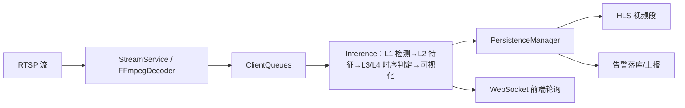

# CleanSight 后端

CleanSight 基于图像识别，检测内镜人工清洗流程的规范性，同时存储近期的检测数据用于追溯。它确保每个人工清洗步骤都正确执行，从而保证患者安全。

## 核心能力

- **实时视频流推理** — 后端以 RTSP 拉流（MediaMTX 负责 RTSP/RTMP 接入），多路并发解码
- **分层 AI 检测** — 不同清洗阶段使用不同模型组，支持 CUDA Stream 并行推理
- **HLS 录制落盘** — raw / processed 双轨视频段自动分段归档，可追溯回放
- **告警上报** — 时序判定产告警，5s 去重闸门 + 批量异步上报
- **实时画面推送** — 渲染后帧经 WebSocket 供前端轮询

> 架构、数据流、各服务内部、配置与 API 等**描述性内容**以知识库为准，入口 [docs/kb/INDEX.md](docs/kb/INDEX.md)。

---

## 项目结构

```
app/
├── main.py              # FastAPI 入口，lifespan 启停各 Service 单例
├── settings.py          # 全局配置（Pydantic Settings，读 .env）
├── database.py          # SQLAlchemy 连接池（PostgreSQL）
├── models.py            # ORM：DBTask / DBAlarm
├── domain/              # 跨服务共享契约（纯 dataclass）：frame / detection / alarm / render
├── routers/             # HTTP/WS 路由：api / ai / task / health / traceback / media / lab / admin
├── services/
│   ├── run_control.py   # RunController — 跨服务起停一次 run 的单一编排出口
│   ├── client/          # ClientManager 注册表（int task_id 键）+ ClientQueues（per-run 不可变 + 状态机）
│   ├── stream/          # FFmpegDecoder（自持读循环，RTSP-only）+ StreamService
│   ├── inference/       # 分层推理：detection/ feature/ temporal/ visualization/ workflows/ offline/
│   ├── persistence/     # HLS 落盘 + 告警落库（strategies/ workers/）
│   ├── health_monitor/  # 断流重连 / 任务超时 / 孤儿清理（委托 RunController）
│   ├── traceback/       # 溯源段定位 + 媒体 token 鉴权
│   └── lab/             # 送标裁剪 + Label Studio 上传
├── data/                # 模型权重：bubble / bend / clean-large / clean-small-best.pt
└── utils/               # 异常 / GuardedExecutor / 网关中间件 / Prometheus 指标 / 上下文
config/                  # 各服务 YAML（inference / stream / persistence / client / health_monitor）
mediamtx_gateway/        # RTSP TCP 代理网关（独立进程，对外部署可选）
tests/  integration_tests/  # 单元 & 组件测试 / 端到端集成测试
docs/                    # 外部文档（API 契约 / 上手 / 规范）；架构知识库见 docs/kb/
```

---

## 环境与配置

### 硬件要求

- **GPU**：RTX 4090（推荐）或其他 CUDA 兼容 GPU；支持降级 CPU 模式（性能较低）
- **内存**：≥ 16GB RAM
- **系统**：Windows 10/11、Ubuntu 20.04+

### 依赖组件

- **FFmpeg**：视频解码（必需）
- **MediaMTX**：流媒体网关，端口 1935（RTMP 接入）/ 8004（RTSP）；二进制不随 git 分发，见部署指南
- **PostgreSQL**：任务与告警持久化

### 配置文件

- 环境变量：`.env` / `.env.dev` / `.env.test`（`CLEANSIGHT_` 前缀，单一真源 `app/settings.py`）
- YAML：`config/inference_config.yaml`、`stream_config.yaml`、`persistence_config.yaml`、`client_config.yaml`、`health_monitor_config.yaml`

> 完整部署步骤（Linux 生产 + Windows 开发安装）见 [部署指南](DEPLOYMENT.md)；开发规范（分支/测试/模块解耦）见 [开发指南](DEVELOPMENT.md)。

---

## 快速开始

```bash
# 启动 MediaMTX（终端 1）
cd mediamtx && ./mediamtx        # Linux；Windows 用 ./mediamtx.exe

# 启动后端（终端 2）
./start_backend.sh dev           # Linux（加载 .env.dev）
.\start_backend.ps1 dev          # Windows
# 或直接：python -m app.main
```

上手流程与接口调用示例见 [快速开始指南](docs/QUICK_START.md)。

### 接口调用流程（统一 API）

1. **启动任务和流**：`POST /api/start`（合并 load_task + start_stream）
2. **接收渲染画面**：`WebSocket /ai/video?task_id={task_id}`（旧 `?client_id=` 双模兼容）
3. **拉取增量消息**：`GET /task/message/{task_id}`（告警增量 + signals_10s）
4. **终止任务**：`POST /api/terminate?task_id={task_id}`（完整清理资源）

---

## 整体架构

CleanSight 采用**流 / 推理 / 持久化解耦**架构，`RunController` 统一编排一次 run 的起停，运行键为 int `task_id`。



### 数据流

```
RTSP (30fps)
  ↓ [FFmpegDecoder 自持读循环，ffmpeg 输出规范化 CFR raw_fps]
ca_ready（SPSC 无锁 deque，Bresenham 抽帧至 inference_fps）   ca_raw（完整录制缓冲）
  ↓ [L1 检测 → L2 特征落盘 → L3 时序产事实 → L4 规则出告警 → 可视化]
ca_processed → [HLS 分段：persistence 周期 PULL 拉取整段]
_latest_rendered 快照 → [WebSocket 前端 ~10ms 轮询，非后端 push]
```

- `ca_ready`：待推理帧，无锁 SPSC deque（decoder 单产 / dispatcher 单消）
- `ca_raw` / `ca_processed`：raw / processed HLS 纯缓冲，persistence 主动拉取分段
- `_latest_rendered` / `_latest_inference` / `_slide_window` / `_latest_temporal`：渲染帧 / 推理快照 / 检测滑窗 / 时序事件

线程角色：检测（StageAwareDispatcher + 每 stage 推理线程，可选 CUDA Stream）、时序（`ClientTemporalActor` per-run ~1Hz）、可视化（独立线程）、持久化（HLS Worker×2 + Alarm Worker×1 + 段 sweeper + 清理 worker）。详见 [知识库](docs/kb/INDEX.md)。

---

## 异常处理

四层边界：L1 `Worker.run()` 兜线程崩溃 → L2 `GuardedExecutor` 重试/快速失败 → L3 FastAPI handler 转 HTTP → L4 `main()` 顶层 fail-fast。自定义异常（retryable/fatal 标记）在 `app/utils/exceptions.py`；丢帧不走异常，由 `frame_drop_total` 指标计数。详见 [知识库](docs/kb/INDEX.md)。

---

## 推理流水线

配置驱动的多阶段推理，检测点拆为无状态 **Detector**（流源）+ per-run **Operator**（流算子，analyze+judge 合并）。当前阶段（`config/inference_config.yaml`）：

- **LEAK**（step `"1"`）：`bubble`（气泡，出生率滑窗 3s、`birth_rate>0.5` 实时告警）+ `bending`（弯折，去抖 5 帧、合格需 4 次弯曲，结算告警）
- **CLEAN**（step `"2"`）：`clean_large` + `clean_small` 仅提供检测框可视化（`rules: []`，不产告警）
- **MOCK**：未知 step 的 fallback，纯透传

**新增检测点**：用 `/infer-workflow` skill 生成 Detector + Operator 框架，规范见 [知识库](docs/kb/INDEX.md)。

---

## 测试

```bash
pytest                                              # 单元 & 组件测试
pytest --cov=app --cov-report=html                  # 覆盖率报告

# 端到端（需真实 RTSP）
python integration_tests/local_full_pipeline_rtsp.py --task_id 1 --duration 30
python integration_tests/remote_full_pipeline_rtsp.py --task_id 1 --duration 60 --server <host>
python integration_tests/stress_test.py --max-tasks 10 --duration 60      # 并发压力
```

---

## API 端点

> 生产已永久关闭 `/docs`、`/redoc`、`/openapi.json`。所有 HTTP/WS 先经 `GatewayMiddleware`（IP 白名单 / 限流 / 反扫描；路由接线见[知识库](docs/kb/INDEX.md)）。下表为速览，端点请求/响应契约与用法见 [docs/api/](docs/api/README.md)（按 router 分文件）。

| 分组 | 端点 |
|------|------|
| 统一 API | `POST /api/start`、`POST /api/terminate`（task_id/client_id 双模） |
| 实时推流 | `WebSocket /ai/video?task_id=...` |
| 消息 / 告警 | `GET /task/message/{task_id}`、`GET /task/{task_id}/alarms` |
| 追溯 | `GET /traceback/alarm/{alarm_id}/evidence`、`/traceback/task/{task_id}/timeline`、playlist |
| 媒体 | `GET /media/segment/{token}`、`/media/init/{token}`（HMAC token 鉴权） |
| 健康 | `GET /health/status`、`/health/monitor/stats`、`/health/monitor/config` |
| 运维 / 送标 | `/admin-f3m8/*`、`/lab-f3m8/*` |

---

## 故障排查

| 现象 | 排查 |
|------|------|
| `ffmpeg not found` | 安装 FFmpeg（`apt install ffmpeg` / `brew install ffmpeg` / `choco install ffmpeg`），`ffmpeg -version` 验证 |
| 数据库连接失败 | 检查 `.env` 数据库配置、服务是否运行、网络/防火墙 |
| `CUDA not available` | `nvidia-smi` 查驱动，`torch.cuda.is_available()` 验证；否则自动降级 CPU |
| 推流超时 / Stream not found | 确认 MediaMTX 运行、URL `rtsp://<host>:8004/live/<name>`、端口 1935/8004 开放 |
| WebSocket 断开 | 检查网络、客户端超时、后端日志 |

设 `LOG_LEVEL=DEBUG` 查看按模块着色的详细日志。更多帮助见 [知识库](docs/kb/INDEX.md) 与 [部署指南](DEPLOYMENT.md)。

---

## 许可证

本项目采用 MIT 许可证。

## 贡献

1. 从 `dev` 切特性分支：`git checkout -b feature/your-feature`
2. 遵循 PEP 8，激活项目 `.venv` 后 `pytest` 全绿
3. 描述性文档改动同步进知识库 `docs/kb/`（维护规则见 [KB_MAINTENANCE](docs/kb/KB_MAINTENANCE.md)）
4. 推送并创建 Pull Request（base：`dev`）

> 完整开发规范（分支提交、测试、模块内聚与解耦）见 [开发指南](DEVELOPMENT.md)。
