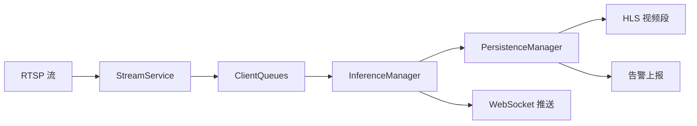

# CleanSight 后端

CleanSight 基于图像识别，检测内镜人工清洗流程的规范性，同时存储近期的检测数据，可以追溯。它确保每个人工清洗步骤都正确执行，从而保证患者安全。

## 核心服务

CleanSight 包含以下核心服务：

- **多路视频流接收与读取** - 支持 RTSP/RTMP 多路并发流处理
- **并行推理** - 不同清洗阶段使用不同模型组，支持 CUDA Stream 并行
- **监控视频落盘** - HLS 视频段自动生成和归档
- **告警信息上报** - 批量去重和实时上报告警
- **实时推理画面展示** - WebSocket 实时推送处理后的视频帧

各服务之间具有良好的隔离，架构设计请见 [整体架构文档](docs/ARCHITECTURE_OVERVIEW.md)。

---

## 项目结构

```
app/
├── data/                    # 存储推理模型参数
│   ├── bubble-best.pt       # 气泡检测模型（6.2MB）
│   └── bend-best.pt         # 弯折检测模型（22.5MB）
├── models/                  # 常用数据模型
│   ├── frame.py             # 帧数据结构
│   ├── task.py              # 任务模型
│   └── status_messages.py   # 状态消息
├── routers/                 # 前端接口（见 [API 文档](docs/API_ENDPOINTS.md)）
│   ├── ai.py                # AI 推理服务路由
│   ├── inspection.py        # 视频流控制路由
│   └── task.py              # 任务管理路由
└── services/                # 各服务模块
    ├── stream/              # 视频流处理服务（FFmpeg 解码、健康监控）
    ├── inference/           # 推理服务（模型推理、时序分析、可视化）
    ├── persistence/         # 持久化服务（HLS 落盘、告警上报）
    ├── client/              # 客户端管理（队列管理、状态管理）
    └── models/              # AI 模型实现（YOLO 检测、时序分析）
```

各服务的详细架构请见对应文档：

- [流处理服务](docs/ARCHITECTURE_OVERVIEW.md#1-streamservice---视频流处理服务)
- [推理服务](docs/INFERENCE_SERVICE_ARCHITECTURE.md)
- [持久化服务](docs/PERSISTENCE.md)

---

## 项目配置

### 硬件要求

- **GPU**: RTX 4090（推荐）或其他 CUDA 兼容 GPU
- **CPU**: 支持降级到 CPU 模式（性能较低）
- **内存**: 至少 16GB RAM

### 系统兼容性

- ✅ Windows 10/11
- ✅ Ubuntu 20.04+

### 环境部署

详细部署步骤请见 [部署指南](docs/DEPLOYMENT_GUIDE.md)，包括：

1. **虚拟环境创建**: Python 3.10+
2. **FFmpeg 安装**: 用于视频解码（必需）
3. **MediaMTX 配置**: 端口 1935（RTMP）、8004（RTSP）
4. **依赖安装**:
   - 生产环境：`opencv-python-headless`（无 GUI）
   - 开发环境：`opencv-python`（支持可视化）

### 配置文件

- **环境变量**: `.env`、`.env.dev`、`.env.test`
- **推理配置**: `config/inference_config.yaml`
- **持久化配置**: `config/persistence_config.yaml`
- **流处理配置**: `config/stream_config.yaml`

配置说明请见 [配置指南](docs/CONFIGURATION_GUIDE.md)。

---

## Quick Start

完整的启动流程和接口调用示例请见 [快速开始指南](docs/QUICK_START.md)。

### 1. 启动服务

> MediaMTX 二进制不随 git 分发,首次需先获取:Linux 部署机由 `./install.sh` 从 `vendor/mediamtx/`
> 解出到 `mediamtx/`(物料由构建机 `./build.sh` 备好)。Windows/手动获取见 [部署指南](docs/DEPLOYMENT_GUIDE.md)。纯部署机可用浅克隆加速:
> `git clone --depth 1 <repo-url>`(跳过历史)。详见 [部署指南](docs/DEPLOYMENT_GUIDE.md)。

```bash
# 启动 MediaMTX（终端 1）
cd mediamtx
./mediamtx.exe    # Windows
# 或 ./mediamtx    # Linux

# 启动后端 API（终端 2）
.\start_backend.ps1 dev   # Windows
# 或 ./start_backend.sh dev  # Linux
```

### 2. 运行测试

```bash
# 本地完整测试（30秒）
python integration_tests/local_full_pipeline_rtsp.py --duration 30

# 远程服务器测试
python integration_tests/remote_full_pipeline_rtsp.py --server 117.50.241.174 --duration 60

# 并发压力测试（10 个并发任务）
python integration_tests/stress_test.py --max-tasks 10 --duration 60
```

### 3. 接口调用流程

**推荐使用统一 API（简化版）**：

1. **启动任务和流**: `POST /api/start` （合并了 load_task + start_rtsp_stream）
2. **接收推理结果**: WebSocket `/ai/video?client_id={client_id}`
3. **监控任务状态**: WebSocket `/task/status/{client_id}`
4. **终止任务**: `POST /api/terminate` （完整清理所有资源）

**传统方式（过渡期保留）**：

1. **加载任务**: `GET /ai/load_task/{task_id}` （⚠️ 将弃用）
2. **启动流**: `POST /inspection/start_rtsp_stream` （⚠️ 将弃用）
3. **接收推理结果**: WebSocket `/ai/video?client_id={client_id}`
4. **监控任务状态**: WebSocket `/task/status/{client_id}`
5. **停止流**: `POST /inspection/stop_rtsp_stream` （⚠️ 将弃用）
6. **终止任务**: `POST /ai/terminate_task/{client_id}` （⚠️ 将弃用）

详细 API 文档请见 [API 端点文档](docs/API_ENDPOINTS.md)。

### 返回数据结构

- **ProcessedFrame**: 处理后的视频帧（Base64 编码）
- **TaskStatusResponse**: 任务状态（阶段、检测结果、告警）
- **InferenceResult**: 推理结果（检测框、关键点、置信度）

数据结构详情请见 [快速开始指南](docs/QUICK_START.md#返回数据结构)。

---

## 整体架构

CleanSight 采用**三服务解耦架构**，通过异步队列协作：



### 数据流

```
RTSP 流 (30fps)
    ↓ [FFmpeg 解码]
ca_ready (20fps) ← 推理队列
ca_raw (30fps)   ← 原始视频队列
    ↓ [AI 推理 + 时序分析 + 可视化]
ca_processed (20fps) ← HLS 落盘
rt_processed (20fps) ← WebSocket 推送
```

### 异步队列设计

- **ca_ready**: 待推理队列（降帧后 20fps）
- **ca_raw**: 原始视频队列（30fps 完整记录）
- **ca_processed**: 处理后队列（用于 HLS 视频段生成）
- **rt_processed**: 实时队列（1 秒缓存，WebSocket 推送）

### 多线程池协作

- **推理线程池**: 每个 Stage 一个推理线程（CUDA Stream 并行）
- **时序分析线程池**: 2-4 个线程处理时序逻辑
- **可视化线程池**: 4-8 个线程绘制检测框
- **持久化线程池**: HLS Worker（2 个）+ 告警 Worker（1 个）

详细架构设计请见 [整体架构文档](docs/ARCHITECTURE_OVERVIEW.md)。

---

## 异常处理与边界层设计

CleanSight 实现了**四层边界异常处理架构**，确保系统稳定性和可观测性：

### 核心设计原则

- **业务代码保持纯净**: 只抛出异常，不捕获异常
- **框架边界层统一处理**: 使用 `GuardedExecutor` 集中管理重试逻辑
- **异常即协议**: 6 个核心自定义异常类型（`AppError` + 5 个服务异常 + `FrameDrop`）
- **显式化决策**: DROP（丢弃）/ RETRY（重试）/ FATAL（致命）

### 四层边界架构

```
┌─────────────────────────────────────────────────────────────┐
│ Layer 4: main() - 顶层 Fail-Fast                              │
│   捕获所有未处理异常，记录 CRITICAL 日志，优雅退出              │
└───────────────────────────────┬─────────────────────────────┘
                                │
┌─────────────────────────────────────────────────────────────┐
│ Layer 3: FastAPI Handlers - HTTP 边界                         │
│   转换异常为 HTTP 状态码（503/500），返回 JSON 错误响应         │
└───────────────────────────────┬─────────────────────────────┘
                                │
┌─────────────────────────────────────────────────────────────┐
│ Layer 2: GuardedExecutor - 框架边界层                         │
│   自动重试（5 种策略）、记录 metrics、决策 Action               │
└───────────────────────────────┬─────────────────────────────┘
                                │
┌─────────────────────────────────────────────────────────────┐
│ Layer 1: Worker.run() - Worker 边界                           │
│   捕获 Worker 线程异常，防止线程崩溃                           │
└─────────────────────────────────────────────────────────────┘
```

### 异常类型

| 异常类型                  | retryable | fatal | 应用场景                           |
| ------------------------- | --------- | ----- | ---------------------------------- |
| `FrameDrop`               | ❌        | ❌    | 单帧失败（安静丢弃，返回 None）    |
| `StreamConnectionError`   | ✅        | ❌    | 流连接超时（网络瞬时故障）         |
| `FFmpegError`             | ❌        | ✅    | 解码器崩溃（需重启流）             |
| `DatabaseError`           | ✅        | ❌    | 数据库连接池耗尽（可重试）         |
| `ModelInferenceError`     | ❌        | ❌    | CUDA OOM（重试无用，不影响其他路） |
| `PersistenceError`        | ✅        | ❌    | HLS 写入失败（磁盘临时满）         |

### 自动重试策略

- **Stream**: 固定延迟 3 秒，最多 5 次（网络波动）
- **Database**: 指数退避（1s → 2s → 4s），最多 3 次（连接池恢复）
- **Persistence**: 指数退避，最多 3 次（磁盘空间释放）
- **Inference**: 固定延迟 1 秒，最多 2 次（快速失败）

### 断线重连

- **心跳检测**: 每 5 秒检查一次，10 秒无帧判定为断流
- **自动重连**: 最多尝试 5 次，每次间隔 3 秒
- **资源清理**: 孤儿流检测（90 秒超时自动清理）

### 可观测性

通过 Prometheus Metrics 监控异常情况：

- `retry_total{operation, error_type}` - 重试计数
- `frame_drop_total{client_id, reason}` - 丢帧计数
- `gpu_oom_total{model}` - GPU OOM 计数

详细设计请见 [边界层设计文档](docs/BOUNDARY_LAYER_DESIGN.md) 和 [异常处理实现](docs/EXCEPTION_HANDLING.md)。

---

## 可扩展的模型与业务接口

CleanSight 支持配置驱动的多阶段推理流水线，针对不同清洗阶段使用不同模型组。

### 已实现的推理流水线

#### LEAK 阶段（泄漏检测）

- **模型组**:
  - bubble_detection（气泡检测，YOLO）
  - bending_detection（内镜弯折检测，YOLO）
- **ClientState 维护**: 使用 `temporal_history` 跟踪 2 秒窗口内的检测结果
- **时序分析逻辑**:
  - 气泡：consecutive 模式（连续 3 帧触发）
  - 弯折：sliding_window 模式（2 秒窗口 70% 比例触发）
- **告警触发**: 检测到气泡或弯折时上报告警

#### CLEAN 阶段（清洁检测）

- **模型组**: 当前为空（可扩展）
- **时序分析**: 支持自定义规则
- **告警触发**: 可配置告警条件

### 开发新流水线

详细开发指南请见 [推理流水线开发文档](docs/PIPELINES.md)，包括：

1. 创建 `InferenceTask` 子类
2. 配置 `inference_config.yaml`
3. 实现时序分析逻辑
4. 定义告警触发条件

---

## 测试方法

### 单元测试

```bash
# 运行所有测试
pytest

# 运行特定模块测试
pytest app/services/inference/tests/

# 带覆盖率报告
pytest --cov=app --cov-report=html
```

### 集成测试

#### 本地测试

```bash
# 完整流程测试（30秒）
python integration_tests/local_full_pipeline_rtsp.py --task_id 1 --duration 30

# 无窗口模式测试
python integration_tests/local_full_pipeline_rtsp.py --task_id 1 --duration 30 --no-window
```

#### 远程测试

```bash
# 远程服务器测试
python integration_tests/remote_full_pipeline_rtsp.py --task_id 1 --duration 60 --server 117.50.46.236

# 自定义视频测试
python integration_tests/remote_full_pipeline_rtsp.py --task_id 1 --video_path path/to/video.mp4 --server 117.50.46.236
```

#### 压力测试

```bash
# 并发压力测试（10个任务）
python integration_tests/stress_test.py --max-tasks 10 --duration 60

# 清理残留进程
python integration_tests/cleanup_processes.py
```

#### 断线重连测试

```bash
# 测试自动重连（15秒推流 → 10秒断流 → 15秒恢复）
python integration_tests/test_reconnect_success.py --task_id 1

# 测试流断开与重连
python integration_tests/test_stream_disconnect_reconnect.py --task_id 1

# 测试超时清理
python integration_tests/test_reconnect_timeout.py --task_id 1
```

详细测试说明请见 [快速开始指南](docs/QUICK_START.md#测试方法)。

---

## API 文档

运行后端服务后，访问以下地址查看交互式 API 文档：

- **Swagger UI**: http://localhost:8000/docs
- **ReDoc**: http://localhost:8000/redoc

### 主要 API 端点

#### 统一 API (`/api`) - **推荐使用**

- `POST /api/start` - 启动任务和流（合并接口）
- `POST /api/terminate` - 终止任务并清理资源（统一清理）

#### 健康监控 (`/health`)

- `GET /health/status` - 获取系统整体状态
- `GET /health/monitor/stats` - 获取健康监控统计
- `GET /health/monitor/config` - 获取健康监控配置

#### 实时数据流 (WebSocket)

- `WebSocket /ai/video` - 实时推理结果流
- `WebSocket /task/status/{client_id}` - 任务状态实时更新

#### 历史数据查询 (`/task`)

- `GET /task/traceback/{task_id}/segments` - 获取视频段列表
- `GET /task/traceback/{task_id}/playlist` - 获取 M3U8 播放列表
- `GET /task/{task_id}/alarms` - 获取告警记录

#### 过渡期保留接口（⚠️ 将在未来版本移除）

**AI 推理服务** (`/ai`):

- `GET /ai/status` - 查询 AI 服务状态（请使用 `GET /health/status`）
- `GET /ai/load_task/{task_id}` - 加载清洗任务（请使用 `POST /api/start`）
- `POST /ai/terminate_task/{client_id}` - 终止任务（请使用 `POST /api/terminate`）

**视频流服务** (`/inspection`):

- `POST /inspection/start_rtsp_stream` - 启动 RTSP 流（请使用 `POST /api/start`）
- `POST /inspection/stop_rtsp_stream` - 停止 RTSP 流（请使用 `POST /api/terminate`）

详细 API 文档请见 [API 端点文档](docs/API_ENDPOINTS.md)。

---

## 故障排查

### 常见问题

#### 1. FFmpeg 未找到

**错误信息**: `FileNotFoundError: ffmpeg not found`

**解决方法**:

```bash
# Windows（使用 Chocolatey）
choco install ffmpeg

# Ubuntu/Debian
sudo apt-get install ffmpeg

# macOS
brew install ffmpeg
```

验证安装：`ffmpeg -version`

#### 2. 数据库连接失败

**错误信息**: `Connection refused` 或 `OperationalError`

**解决方法**:

1. 检查 `.env` 文件中的数据库配置
2. 确认数据库服务正在运行
3. 验证网络连接和防火墙设置

#### 3. GPU 不可用

**错误信息**: `CUDA not available`

**解决方法**:

1. 检查 NVIDIA 驱动安装：`nvidia-smi`
2. 验证 PyTorch CUDA 支持:
   ```python
   import torch
   print(torch.cuda.is_available())
   print(torch.cuda.get_device_name(0))
   ```
3. 系统会自动降级到 CPU 模式（性能较低）

#### 4. 推流连接超时

**错误信息**: `Connection timeout` 或 `Stream not found`

**解决方法**:

1. 确认 MediaMTX 服务正在运行
2. 检查推流 URL 格式：`rtsp://localhost:8004/live/<stream_name>`
3. 查看 MediaMTX 日志：检查端口占用和权限问题
4. 防火墙设置：确保端口 1935（RTMP）和 8004（RTSP）开放

#### 5. WebSocket 断开连接

**错误信息**: `WebSocket connection closed`

**解决方法**:

1. 检查网络稳定性
2. 增加 WebSocket 超时时间（在客户端配置）
3. 查看后端日志中的异常信息

### 日志查看

查看详细日志以诊断问题：

```bash
# 设置日志级别为 DEBUG
export LOG_LEVEL=DEBUG  # Linux/Mac
set LOG_LEVEL=DEBUG     # Windows

# 查看特定服务日志
# 日志会按模块区分颜色和前缀，便于定位问题
```

### 更多帮助

如果遇到其他问题，请查看：

- [配置指南](docs/CONFIGURATION_GUIDE.md)
- [部署指南](docs/DEPLOYMENT_GUIDE.md)
- [异常处理文档](docs/EXCEPTION_HANDLING.md)
- GitHub Issues：提交新问题或查看已知问题

---

## 许可证

本项目采用 MIT 许可证。详见 [LICENSE](LICENSE) 文件。

---

## 贡献指南

欢迎贡献代码、报告问题或提出改进建议！

### 贡献流程

1. Fork 本仓库
2. 创建特性分支：`git checkout -b feature/your-feature`
3. 提交更改：`git commit -m "Add your feature"`
4. 推送到分支：`git push origin feature/your-feature`
5. 创建 Pull Request

### 代码规范

- 遵循 PEP 8 Python 代码规范
- 添加必要的注释和文档字符串
- 确保所有测试通过：`pytest`
- 更新相关文档

### 文档贡献

- 技术文档位于 `docs/` 目录
- 使用 Markdown 格式
- 包含清晰的示例和图表

---

## 致谢

感谢所有贡献者和使用 CleanSight 的医疗机构！

**最后更新**: 2026-02-08
