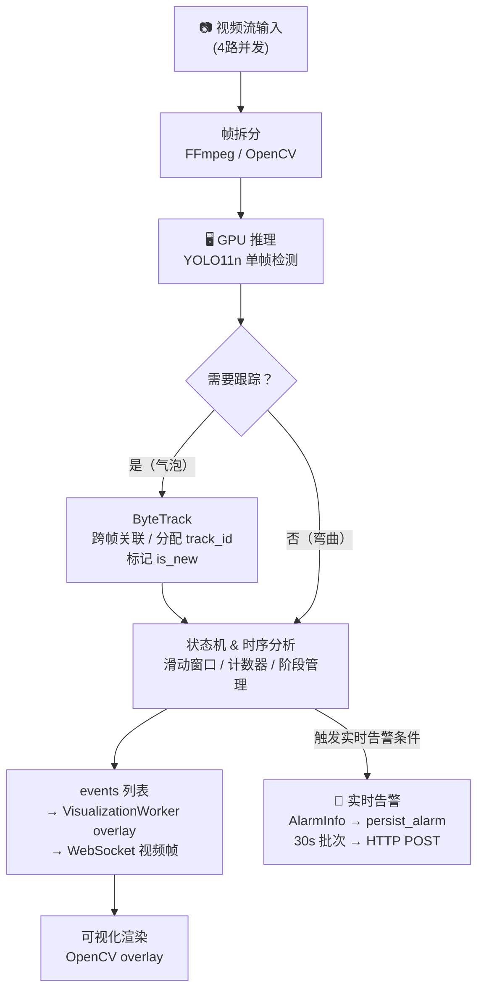
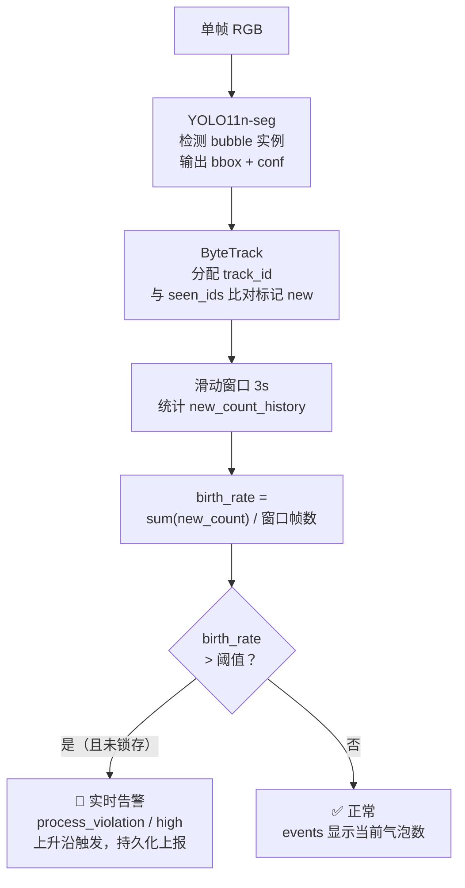
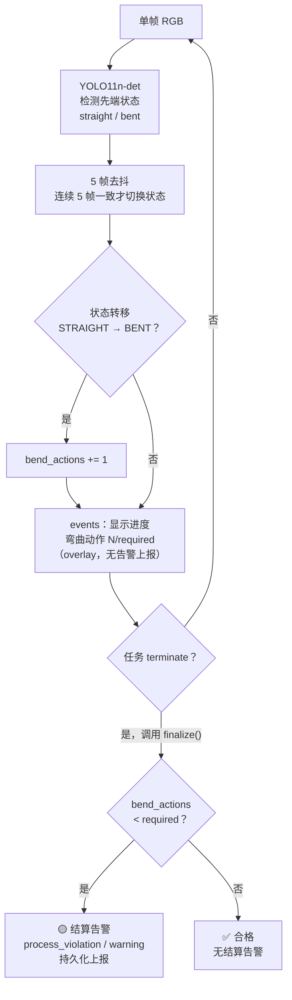

# 检测 Workflow

## 整体流程

> **CPU / GPU 分工**：GPU 推理只做无状态单帧处理；ByteTrack、状态机、告警全在 CPU 上完成。

---

## 流处理框架（流源 Detector / 流算子 Operator）

每个 stage 拆 `detectors[]`（流源，分组粒度）+ `rules[]`（流算子，规则粒度）：

| 角色 | 基类 | 职责 | 状态机 |
| -- | ---- | ---- | ------ |
| 流源 | `Detector` / `YOLODetector` | 单帧检测，bbox=特征。无状态，多 Client 共享；`name` = 该 detector 产出的流名（= `FrameFeature.by_source` 的 key） | 无 |
| 流算子 | `Operator` | 合并 analyze+judge，单 `_sm`：`analyze(windows: List[FrameFeature])` `_clip` 到 `window_seconds` 感受野、按 `subscribes` 从 `by_source` 取订阅流、推进 `_sm`；`judge()` 读 `_sm` 出 (overlay 文案, 告警)；`finalize()` 结算。一个 Operator = 一条规则，每 Client 独立 | 共享状态机 `self._sm`（测量 + 决策同一份） |

> `name`（算子自身/输出身份）与 `subscribes`（输入流清单，显式必填）正交：算子名 ≠ 流名。
> 多流对齐在**写回口**一次完成：整帧 `FrameInference` 物化成帧级 `FrameFeature`（`ts + {流名: FrameDetections}`），
> 算子直接读 `by_source`，无需 zip（单订阅用基类 `primary_window` 投影自身流）。
> 阈值/required 归算子自身字段；`AlarmInfo.metric` 由算子显式填，不依赖 name。

特征由推理写回处常开落盘到 `FeatureStore`（`{task_id}/{step_id}/features.jsonl`，与 HLS 同款工作目录，按帧 `ts` 对齐）。实时链路**不落盘事实**（已无 EventFact 对象间传输，状态共享于 `_sm`）；`FactLedger`（`{task_id}/{step_id}/facts.jsonl`）为 offline 预置，待离线 segmenter 接入后写 `SegmentFact`。

## 两种告警模式

| 模式 | 触发时机 | 来源方法 | 去向 |
| ------ | --------- | --------- | ------ |
| 实时告警 | TemporalActor 2Hz 轮询，`operator.analyze()` 推进状态 → `operator.judge()` 上升沿触发 | `Operator.judge()` | persist_alarm → 30s 批次 → HTTP POST 外部数据库 |
| 结算告警 | 任务 terminate 时调用一次 | `Operator.finalize()` | 同上，由 `ClientTemporalActor.finalize_and_stop()` 收集、`InferenceManager._persist_settlement_alarms()` 驱动 |

> **UI 通知**：`events`（字符串列表）经 VisualizationWorker 渲染为视频帧 overlay，通过 WebSocket 实时推送给前端。`AlarmInfo` 只走持久化，不直接推给前端。

---

## 各检测点详细流程

### 1.1 漏气检测

> 无结算告警，漏气是实时检测，任务结束时 `finalize()` 返回空列表。

---

### 1.2 弯曲动作检测

> 实时阶段只产出 `events`（进度 overlay），**不上报告警**。  
> 合格（`bend_actions >= required`）无告警；不合格才在 terminate 时上报 warning。
