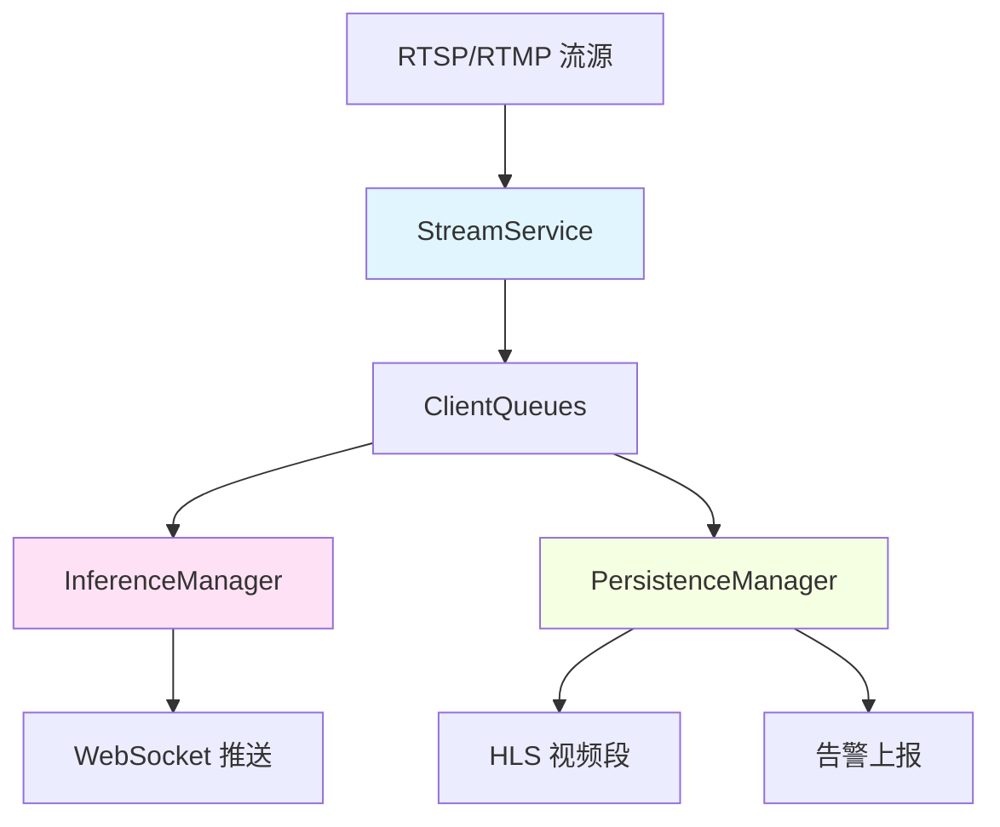

# CleanSight 整体架构概览

本文档介绍 CleanSight 后端系统的整体架构设计、核心服务组件、数据流向和线程池协作机制。

## 目录

- [架构概述](#架构概述)
- [三服务解耦架构](#三服务解耦架构)
- [数据流与帧率控制](#数据流与帧率控制)
- [ClientQueues 队列系统](#clientqueues-队列系统)
- [线程池协作](#线程池协作)
- [ClientState 状态管理](#clientstate-状态管理)

---

## 架构概述

CleanSight 采用**三服务解耦架构**（Decoupled Three-Service Architecture），将视频流处理、AI 推理和数据持久化分离为独立服务，通过共享队列（ClientQueues）进行协作。

### 架构设计原则

1. **服务解耦**：每个服务独立运行，便于维护和扩展
2. **异步处理**：通过队列缓冲数据，避免服务间相互阻塞
3. **资源隔离**：每个客户端（视频流）维护独立的队列和状态
4. **配置驱动**：通过 YAML 配置文件动态加载模型和参数

### 核心组件关系图



---

## 三服务解耦架构

### 1. StreamService - 视频流处理服务

**位置**: `app/services/stream/service.py`

**职责**：
- 管理 RTSP/RTMP 流的拉取和解码
- 使用 FFmpeg 子进程解码视频流
- 将解码后的帧写入 ClientQueues
- 健康监控和自动重连

**核心类**：
- `StreamService`: 单例服务，管理所有解码器
- `FFmpegDecoder`: 包装 FFmpeg 进程
- `StreamHealthMonitor`: 流健康检测（5秒检查，10秒超时）
- `CleanupService`: 孤儿流清理（30秒检查，90秒超时）

**配置** (`config/stream_config.yaml`):
```yaml
decoder:
  default_fps: 30
  backpressure_ratio: 0.90    # 队列90%满时丢帧

health_monitor:
  check_interval: 5.0
  heartbeat_timeout: 10.0
  max_restart_attempts: 5
```

### 2. InferenceManager - AI 推理服务

**位置**: `app/services/inference/core/manager.py`

**职责**：
- 调度多路视频流的 AI 推理
- 支持多阶段推理（LEAK/CLEAN 等）
- 时序分析、可视化、结果写回

**核心组件**：

1. **StageAwareDispatcher** (`dispatcher.py`)
   - Round-Robin 轮询客户端的 `ca_ready` 队列
   - 按客户端当前阶段分组批量取帧
   - 生成 `InferenceRequest` 批量提交

2. **MultiModelWorkerPool** (`workers/base.py`)
   - 为每个 Stage 创建模型池
   - 支持 CUDA Stream 并行
   - 调用 `InferenceTask.infer_batch()` 批量推理

3. **时序分析** (`workers/temporal.py`)
   - 分析连续推理结果
   - 支持 consecutive（连续帧）、sliding_window（时间窗口）模式
   - 更新 ClientState 业务状态

4. **可视化** (`workers/visualization.py`)
   - 异步执行，不阻塞推理
   - 绘制检测框、关键点
   - 补偿降帧（使用最新原始帧 + 缓存的检测结果）

5. **结果写回** (`workers/writeback.py`)
   - 写入 `ca_processed` 队列（HLS 落盘）
   - 写入 `rt_processed` 队列（WebSocket 推送）

**配置** (`config/inference_config.yaml`):
```yaml
stages:
  LEAK:
    models:
      - name: bubble_detection
        model_path: ./app/data/bubble-best.pt
        conf_threshold: 0.5
    temporal_analyzer:
      bubble:
        mode: consecutive
        threshold: 3       # 连续3帧

global:
  inference_fps: 20
  batch_size: 4
  ca_segment_len: 300      # 约10秒@30fps
```

### 3. PersistenceManager - 持久化服务

**位置**: `app/services/persistence/manager.py`

**职责**：
- 管理 HLS 视频段的落盘
- 管理告警信息的批量上报

**核心组件**：

1. **HLSWorkerPool** (`workers/hls_worker.py`)
   - 2个并行 Worker
   - 消费 `hls_queue` 中的持久化任务
   - 调用 FFmpeg 生成 MP4 和 M3U8

2. **AlarmWorkerPool** (`workers/alarm_worker.py`)
   - 1个 Worker
   - 批量去重和聚合告警
   - 定期上报到外部系统

**配置** (`config/persistence_config.yaml`):
```yaml
hls:
  workers: 2
  segment_duration: 10     # 秒

alarm:
  workers: 1
  batch_interval: 30       # 批量刷新间隔
  cooldown_seconds: 60     # 告警冷却期
```

---

## 数据流与帧率控制

### 帧处理流程

```
RTMP 流 (30fps)
    ↓ [StreamService - FFmpeg 解码]
ca_ready (20fps) ← 降频采样（推理队列）
ca_raw (30fps)   ← 原始保存（完整记录）
    ↓ [InferenceService - AI推理 + 时序分析 + 可视化]
ca_processed (20fps) ← HLS 落盘
rt_processed (20fps) ← WebSocket 推送
```

### 帧率配置参数

| 参数 | 默认值 | 作用 |
|------|--------|------|
| `raw_fps` | 30 | 原始视频帧率（完整记录） |
| `inference_fps` | 20 | 推理采样频率、处理视频帧率 |
| `ca_maxlen` | 2700帧 | ≈90秒@30fps 内存缓存 |
| `ca_segment_len` | 300帧 | ≈10秒@30fps，触发落盘 |
| `rt_maxlen` | 30帧 | ≈1秒@30fps，最新结果缓存 |

---

## ClientQueues 队列系统

每个客户端（视频流）维护独立的四层队列：

```python
class ClientQueues:
    ca_ready: Deque[FrameData]      # 待推理队列（20fps）
    ca_raw: Deque[FrameData]        # 原始视频队列（30fps）
    ca_processed: Deque[FrameData]  # 处理后队列（20fps）
    rt_processed: Deque[FrameData]  # 实时推送队列（~1秒）

    state: ClientState              # 业务状态
    task: Optional[CleaningTask]    # 关联任务
```

### 队列功能详解

1. **ca_ready（待推理队列）**
   - 存储降频后的帧（20fps）
   - InferenceManager 从此队列取帧
   - maxlen: 600帧（约30秒@20fps）

2. **ca_raw（原始视频队列）**
   - 存储完整帧率视频（30fps）
   - 用于可视化时取最新原始帧
   - maxlen: 2700帧（约90秒@30fps）

3. **ca_processed（处理后队列）**
   - 存储推理+可视化后的帧（20fps）
   - 触发 HLS 视频段生成
   - maxlen: 2700帧（约90秒@20fps）

4. **rt_processed（实时队列）**
   - 存储最新的处理帧
   - WebSocket 推送给前端
   - maxlen: 30帧（约1秒缓存）

---

## 线程池协作

CleanSight 使用多个线程池并行处理：

### 1. 推理线程池（ModelWorkerService）

```python
ThreadPoolExecutor(max_workers=num_stages)
# 每个 Stage 一个推理线程
# 例如：InferWorker-LEAK, InferWorker-CLEAN
```

**特点**：
- CUDA Stream 并行（每个模型独立 Stream）
- 批量处理（batch_size=4）
- 自动负载均衡

### 2. 时序分析线程池（TemporalWorkerPool）

```python
num_workers = 2-4
```

**功能**：
- 分析连续推理结果
- 支持 consecutive 和 sliding_window 模式
- 更新 ClientState

### 3. 可视化线程池（VisualizationWorkerPool）

```python
num_workers = 4-8
```

**功能**：
- 异步绘制检测框和关键点
- 不阻塞推理线程
- 降帧补偿（最新原始帧 + 缓存的检测结果）

### 4. 持久化线程池

```python
HLSWorkerPool(num_workers=2)     # HLS 落盘
AlarmWorkerPool(num_workers=1)   # 告警上报
```

### 异步管道架构

```
StageAwareDispatcher (轮询取帧)
    ↓
MultiModelWorkerPool (并行推理)
    ↓ InferenceResult
TemporalWorkerPool (时序分析)
    ↓ TemporalAnalysisPackage
VisualizationWorkerPool (可视化)
    ↓ WriteBackData
WriteBackWorkerPool (结果写回)
    ↓
ca_processed / rt_processed
```

---

## ClientState 状态管理

**位置**: `app/services/client/state.py`

`ClientState` 用于维护每个客户端的业务状态。

### 核心接口

```python
class ClientState:
    # 阶段管理
    get_stage() / set_stage(stage)
    is_step_completed() / mark_step_completed()
    reset_step()

    # 自定义状态
    set_custom(key, value)
    get_custom(key)
    update_custom(updates)

    # 时序计数器
    increment_counter(key) / get_counter(key) / reset_counter(key)

    # 时间窗口历史（2秒窗口）
    push_temporal_history(key, value, timestamp)
    get_temporal_history(key) → List[(timestamp, value)]
    get_temporal_values(key) → List[values]
```

### 使用示例

```python
# 推理过程中跟踪时序数据
state.push_temporal_history(
    "bubble_detections",
    bubble_detected,
    timestamp=time.time()
)

# 查询2秒窗口内的检测历史
history = state.get_temporal_history("bubble_detections")
detection_count = len([v for _, v in history if v])

if detection_count >= 3:
    state.mark_step_completed()
```

---

## 性能优化设计

### 1. 内存保护

- 所有队列设置 maxlen，自动丢弃旧帧
- 背压控制：队列满 90% 时主动丢帧

### 2. CUDA Stream 并行

- 每个模型独立 CUDA Stream
- 真正的 GPU 并行计算

### 3. 异步管道

- 推理 → 时序分析 → 可视化 → 写回
- 各阶段不相互阻塞

### 4. 配置驱动

- YAML 定义 Stage、模型、参数
- 无需重编译修改配置

### 5. 健康监控

- 流断连自动重连（最多5次）
- 孤儿流自动清理
- 资源泄漏防护

---

## 相关文档

- [推理服务架构](INFERENCE_SERVICE_ARCHITECTURE.md) - 推理服务详细设计
- [配置驱动架构](CONFIG_DRIVEN_ARCHITECTURE.md) - 配置文件说明
- [持久化策略](PERSISTENCE.md) - HLS 和告警持久化
- [断线重连实现](STREAM_RECONNECT_IMPLEMENTATION.md) - 重连机制
- [异常处理](EXCEPTION_HANDLING.md) - 容错机制

---

**最后更新**: 2026-01-30
