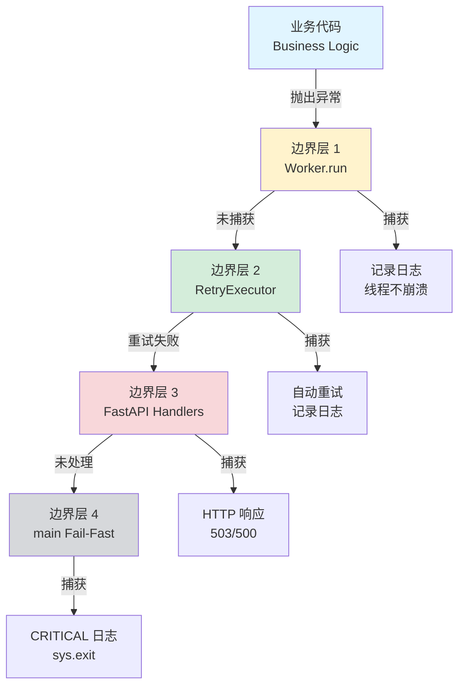

# StreamService 异常流转与边界层架构

> **版本**: 2.0
> **日期**: 2026-04-13

## 概述

本文档详细说明 CleanSight Backend 中 StreamService 模块的异常来源、流转路径以及 4 个边界层的捕获职责。

**核心原则**：

- 业务代码保持纯净：只抛异常，不捕获异常
- 可由上层异步监控接管重连的路径（如 `start_stream`）**不再**走 RetryExecutor，首次失败即返回、不阻塞调用方
- 其他需要同步重试的路径仍由 RetryExecutor（`GuardedExecutor`）统一管理
- 异常捕获在 4 个边界层：Worker.run(), RetryExecutor, FastAPI handlers, main()

## v2.0 变更摘要（2026-04-13）

- **`start_stream` 去 RetryExecutor**：取消包装，首次 `decoder.start()` 失败仅记 WARNING 并 return，decoder 仍留在 `self.decoders` 中，由 `StreamHealthMonitor` 异步接管重连。消除双重重试导致的日志与行为不确定。
- **`restart_stream` 从未经过 RetryExecutor**：由健康监控周期性调度，单次失败返回 False，监控下一周期会再试。本节 3.2 中对应段落仅保留作为"业务代码抛异常示例"。
- **`StreamConnectionError` 语义收敛**：可重试（瞬态网络/推流端未就绪），日志级别 WARNING；`FFmpegError` 为致命（二进制错误/启动崩溃），日志级别 ERROR。详见 [STREAM_RECONNECT_IMPLEMENTATION.md](STREAM_RECONNECT_IMPLEMENTATION.md)。
- **边界层 3 日志噪声降低**：移除 `exc_info=True` 与流 URL 打印，异常摘要已包含在 msg 中。

---

## 1. 异常来源与类型

### 1.1 核心异常类

| 异常类 | retry_able | 适用场景 | 处理策略 |
|--------|-----------|----------|----------|
| `StreamConnectionError` | ✅ True | RTSP/RTMP 连接失败 | 固定延迟 3s，最多 5 次 |
| `FFmpegError` | ❌ False | FFmpeg 进程错误 | 不重试，直接失败 |
| `DatabaseError` | ✅ True | 数据库连接/查询失败 | 指数退避，最多 3 次 |
| `ModelInferenceError` | ❌ False | 模型推理错误（CUDA OOM） | 不重试，记录错误 |
| `PersistenceError` | ✅ True | HLS 写入/告警上报失败 | 指数退避，最多 3 次 |

### 1.2 异常来源地图

```
StreamService 模块异常来源
│
├─ start_stream()
│   ├─ ClientManager.get_or_create() → DatabaseError
│   ├─ FFmpegDecoder.__init__() → FFmpegError
│   ├─ FFmpegDecoder.start() → StreamConnectionError
│   └─ selector.register() → StreamConnectionError
│
├─ stop_stream()
│   ├─ FFmpegDecoder.stop() → FFmpegError（后台线程中捕获）
│   └─ selector.unregister() → 内部处理，不抛出
│
├─ restart_stream()
│   ├─ ClientManager.get_client() → DatabaseError
│   ├─ FFmpegDecoder.__init__() → FFmpegError
│   ├─ FFmpegDecoder.start() → StreamConnectionError
│   └─ selector.register() → StreamConnectionError
│
├─ _selector_loop()（后台线程）
│   ├─ selector.select() → OSError
│   ├─ FFmpegDecoder.on_stdout_ready() → 内部处理，返回 False
│   └─ selector.close() → OSError
│
└─ HealthMonitor._monitor_loop()（后台线程）
    ├─ ClientManager.get_all_clients() → DatabaseError
    ├─ restart_stream() → StreamConnectionError, FFmpegError
    └─ CleanupService.cleanup_client() → PersistenceError
```

---

## 2. 四层边界架构

### 2.1 架构概览



### 2.2 边界层职责矩阵

| 边界层 | 位置 | 职责 | 捕获方式 | 处理策略 |
|--------|------|------|----------|----------|
| **边界层 1** | Worker.run() | 防止线程崩溃 | `try/except Exception` | 记录日志，线程继续运行 |
| **边界层 2** | RetryExecutor | 统一重试逻辑 | 框架自动捕获 | 根据策略重试，失败后抛出 |
| **边界层 3** | FastAPI Handlers | HTTP 异常转换 | `@app.exception_handler` | 返回 HTTP 503/500 |
| **边界层 4** | main() | 顶层 Fail-Fast | `try/except Exception` | CRITICAL 日志 + sys.exit(1) |

---

## 3. 边界层详细说明

### 3.1 边界层 1：Worker.run() - 线程入口

**职责**：捕获所有异常，防止后台线程崩溃

#### 实现位置

##### (1) StreamService._selector_loop()

```python
def _selector_loop(self, timeout: float = 0.05):
    """
    Selector 轮询线程（边界层 1）
    """
    try:
        while not self._stop_event.is_set():
            try:
                # 业务逻辑：持续轮询
                self.run_once(timeout=timeout)
            except Exception as e:
                # 边界层 1 捕获异常
                logger.error(
                    f"[BoundaryLayer1] Error in selector loop: {e}",
                    exc_info=True
                )
                time.sleep(1.0)
    finally:
        # 资源清理
        self._cleanup_selector()
```

**位置**: [app/services/stream/service.py:565-587](../app/services/stream/service.py#L565-L587)

##### (2) StreamService._stop_decoder_async() worker

```python
def _stop_decoder_async(self, decoder: FFmpegDecoder, client_id: str):
    """异步停止解码器"""
    def stop_decoder_worker():
        """Worker 线程（边界层 1）"""
        try:
            # 业务逻辑：停止解码器（可能阻塞 2 秒+）
            decoder.stop()
            logger.debug(f"[{client_id}] FFmpeg process stopped")
        except Exception as e:
            # 边界层 1 捕获异常
            logger.error(
                f"[BoundaryLayer1] Failed to stop FFmpeg for {client_id}: {e}",
                exc_info=True
            )

    stop_thread = threading.Thread(
        target=stop_decoder_worker,
        daemon=True,
        name=f"stop-decoder-{client_id}"
    )
    stop_thread.start()
```

**位置**: [app/services/stream/service.py:293-325](../app/services/stream/service.py#L293-L325)

##### (3) HealthMonitor._monitor_loop()

```python
def _monitor_loop(self):
    """
    监控线程入口（边界层 1）
    """
    try:
        while not self._stop_event.is_set():
            try:
                # 业务逻辑：检查所有客户端
                self._check_all_clients()
                self._stop_event.wait(timeout=self._check_interval)
            except Exception as e:
                # 边界层 1 捕获异常
                logger.error(
                    f"[BoundaryLayer1] Error in monitor loop: {e}",
                    exc_info=True
                )
                time.sleep(1.0)
    finally:
        logger.info("[StreamHealthMonitor] Monitor loop exited")
```

**位置**: [app/services/stream/health_monitor.py:106-136](../app/services/stream/health_monitor.py#L106-L136)

#### 边界层 1 异常流转图

```
┌─────────────────────────────────────────────────────────────┐
│                    边界层 1: Worker.run()                     │
├─────────────────────────────────────────────────────────────┤
│                                                               │
│  后台线程入口                                                  │
│  ┌─────────────────┐                                         │
│  │ while not stop: │                                         │
│  │   try:          │                                         │
│  │     业务逻辑()   │ ──── 抛出异常 ────┐                    │
│  │   except:       │                   │                    │
│  │     记录日志     │ ◄─────────────────┘                    │
│  │     sleep(1s)   │   捕获所有异常                          │
│  │   finally:      │                                         │
│  │     清理资源()   │                                         │
│  └─────────────────┘                                         │
│                                                               │
│  效果：线程不崩溃，继续运行                                     │
└─────────────────────────────────────────────────────────────┘
```

---

### 3.2 边界层 2：RetryExecutor - 框架边界层

**职责**：统一管理重试逻辑，业务代码保持纯净。

> **2026-04 更新**：`start_stream` **已不再走 RetryExecutor**。见本节下文的 "`start_stream` 非重试示例"。StreamService 中 RetryExecutor 的典型用例目前仅剩少数路径，保留本节的原因是它仍是其他 Service（DB/推理）继续使用的框架。

#### `start_stream` 非重试示例（v2.0 现状）

```python
@log_call(level=logging.INFO, log_args=False)
def start_stream(self, client_id: str, stream_url: str, fps: int = 30, protocol: str = "RTMP"):
    """注册解码器并尝试首次启动。
    decoder 注册成功后立即返回，不等待流连接结果。
    首次 start() 若失败，健康监控会在下一个心跳周期发起重连。
    """
    self._start_stream_impl(client_id, stream_url, fps, protocol)

def _start_stream_impl(self, client_id, stream_url, fps, protocol):
    with self.lock:
        # ... 前置检查、URL 重写、创建 decoder ...

        # 先注册，再启动——健康监控可感知启动失败并触发重连
        self.decoders[client_id] = dec
        try:
            dec.start()
        except Exception as e:
            logger.warning(f"[{client_id}] Initial start failed: {e}")
            return  # 不抛异常，不重试，让健康监控接管
```

**位置**: [app/services/stream/service.py:97-213](../app/services/stream/service.py#L97-L213)

**为什么去掉 RetryExecutor**：原先 `start_stream()` 外层的 15s 指数退避与 `StreamHealthMonitor` 的 5s 周期重连形成双重机制，出现过"调用方被阻塞 ~40s 后返回失败，但健康监控已连上"的矛盾状态。现在调用方立刻返回 200，流的最终可用性交给健康监控保证。

##### `restart_stream()` - 不使用 RetryExecutor（由健康监控调度）

```python
@log_call(level=logging.INFO, log_args=False)
def restart_stream(self, client_id: str, stream_url: str, fps: int, protocol: str) -> bool:
    """服务层方法：重启流（不使用 GuardedExecutor）

    健康监控器按固定间隔调用，单次失败返回 False，下一周期再试。
    """
    try:
        self._restart_stream_impl(client_id, stream_url, fps, protocol)
        return True
    except Exception as e:
        logger.warning(f"[StreamService] restart_stream failed: {client_id}, error={str(e)[:100]}")
        return False

def _restart_stream_impl(self, client_id: str, stream_url: str, fps: int, protocol: str) -> bool:
    """业务代码：重启流实现（纯净，只抛异常）"""
    # ... 业务逻辑
    if client_manager is None or not client_manager.has_client(client_id):
        # 业务逻辑：抛出异常（不捕获）
        raise StreamConnectionError(
            url=stream_url,
            client_id=client_id,
            details="Cannot restart stream: no ClientQueues"
        )
    # ... 其他业务逻辑
```

**位置**: [app/services/stream/service.py:382-460](../app/services/stream/service.py#L382-L460)

#### RetryExecutor 重试策略

```python
# 预定义策略（app/utils/executor.py）
RETRY_POLICIES = {
    'stream': RetryPolicy(
        max_attempts=5,
        delay=3.0,           # 固定延迟 3 秒
        backoff=False,       # 不使用指数退避
        backoff_factor=2.0,
        max_delay=30.0
    ),
    'database': RetryPolicy(
        max_attempts=3,
        delay=1.0,
        backoff=True,        # 使用指数退避
        backoff_factor=2.0,  # 1s → 2s → 4s
        max_delay=10.0
    ),
    # ... 其他策略
}
```

#### 边界层 2 异常流转图

```
┌─────────────────────────────────────────────────────────────┐
│                边界层 2: RetryExecutor                        │
├─────────────────────────────────────────────────────────────┤
│                                                               │
│  服务层调用                                                    │
│  ┌─────────────────────────────────────────────┐            │
│  │ executor.execute(                            │            │
│  │     func=_start_stream_impl,                │            │
│  │     policy_name='stream'                    │            │
│  │ )                                            │            │
│  └───────────────┬─────────────────────────────┘            │
│                  │                                            │
│                  ▼                                            │
│  ┌─────────────────────────────────────────────┐            │
│  │ 执行业务代码                                  │            │
│  │ ┌──────────────────┐                        │            │
│  │ │ _start_stream_impl() │ ──抛出异常──┐      │            │
│  │ └──────────────────┘                │      │            │
│  │                                      │      │            │
│  │ ┌────────────────────────────────┐  │      │            │
│  │ │ 捕获异常                        │ ◄─┘      │            │
│  │ │ - 检查 retry_able = True?      │          │            │
│  │ │ - 尝试次数 < max_attempts?     │          │            │
│  │ │   ├─ YES: 等待 delay，重试     │          │            │
│  │ │   └─ NO: 抛出原始异常          │          │            │
│  │ └────────────────────────────────┘          │            │
│  └─────────────────────────────────────────────┘            │
│                                                               │
│  重试流程:                                                     │
│  尝试 1 失败 → 等待 3s → 尝试 2 失败 → ... → 尝试 5 失败       │
│                       ↓                                       │
│                  抛出异常到上层                                │
└─────────────────────────────────────────────────────────────┘
```

---

### 3.3 边界层 3：FastAPI 全局异常处理器

**职责**：捕获所有 HTTP 请求中的异常，转换为友好的 HTTP 响应

#### 实现位置

```python
# app/main.py

@app.exception_handler(StreamConnectionError)
async def stream_error_handler(request: Request, exc: StreamConnectionError):
    """
    流连接错误处理器（边界层 3）
    """
    logger.error(
        f"[BoundaryLayer3] Stream connection error: {exc}",
        exc_info=True,
        extra={
            "client_id": exc.client_id,
            "url": str(request.url),
            "method": request.method,
        }
    )
    return JSONResponse(
        status_code=503,  # Service Unavailable
        content={
            "error": "Stream unavailable",
            "detail": str(exc),
            "client_id": exc.client_id,
        }
    )

@app.exception_handler(FFmpegError)
async def ffmpeg_error_handler(request: Request, exc: FFmpegError):
    """FFmpeg 错误处理器（边界层 3）"""
    logger.error(f"[BoundaryLayer3] FFmpeg error: {exc}", exc_info=True)
    return JSONResponse(
        status_code=500,  # Internal Server Error
        content={"error": "FFmpeg error", "detail": str(exc)}
    )

@app.exception_handler(DatabaseError)
async def database_error_handler(request: Request, exc: DatabaseError):
    """数据库错误处理器（边界层 3）"""
    logger.error(f"[BoundaryLayer3] Database error: {exc}", exc_info=True)
    return JSONResponse(
        status_code=503,  # Service Unavailable
        content={
            "error": "Database unavailable",
            "detail": str(exc),
            "retry_able": exc.retry_able,
        }
    )

@app.exception_handler(Exception)
async def generic_exception_handler(request: Request, exc: Exception):
    """兜底异常处理器（边界层 3）"""
    logger.error(f"[BoundaryLayer3] Uncaught exception: {exc}", exc_info=True)
    return JSONResponse(
        status_code=500,
        content={
            "error": "Internal server error",
            "detail": "An unexpected error occurred. Please contact support if the issue persists.",
        }
    )
```

**位置**: [app/main.py:67-272](../app/main.py#L67-L272)

#### 边界层 3 异常流转图

```
┌─────────────────────────────────────────────────────────────┐
│           边界层 3: FastAPI 全局异常处理器                     │
├─────────────────────────────────────────────────────────────┤
│                                                               │
│  HTTP 请求                                                     │
│  ┌────────────────┐                                          │
│  │ POST /start    │                                          │
│  └────────┬───────┘                                          │
│           │                                                   │
│           ▼                                                   │
│  ┌─────────────────────────────────────────┐                │
│  │ API 路由                                 │                │
│  │ async def start_stream():               │                │
│  │     stream_service.start_stream(...)    │                │
│  │         ↓                                │                │
│  │     边界层 2: RetryExecutor              │                │
│  │         ↓                                │                │
│  │     业务代码抛出 StreamConnectionError    │                │
│  └─────────────────────┬───────────────────┘                │
│                        │ 异常向上传播                         │
│                        ▼                                     │
│  ┌─────────────────────────────────────────┐                │
│  │ @app.exception_handler                  │                │
│  │ (StreamConnectionError)                 │                │
│  │ ┌─────────────────────────────────────┐ │                │
│  │ │ 1. 记录日志（包含 client_id、URL）   │ │                │
│  │ │ 2. 返回 HTTP 503 Service Unavailable │ │                │
│  │ │ 3. JSON 响应:                         │ │                │
│  │ │    {                                  │ │                │
│  │ │      "error": "Stream unavailable",   │ │                │
│  │ │      "detail": "...",                 │ │                │
│  │ │      "client_id": "192.168.1.100"     │ │                │
│  │ │    }                                  │ │                │
│  │ └─────────────────────────────────────┘ │                │
│  └─────────────────────────────────────────┘                │
│                        │                                     │
│                        ▼                                     │
│  ┌─────────────────────────────────────────┐                │
│  │ HTTP 响应: 503 Service Unavailable      │                │
│  └─────────────────────────────────────────┘                │
│                                                               │
└─────────────────────────────────────────────────────────────┘
```

#### 异常 → HTTP 状态码映射

| 异常类 | HTTP 状态码 | 含义 | 重试建议 |
|--------|------------|------|---------|
| `StreamConnectionError` | 503 | Service Unavailable | 客户端应稍后重试 |
| `FFmpegError` | 500 | Internal Server Error | 不建议重试 |
| `DatabaseError` | 503 | Service Unavailable | 客户端应稍后重试 |
| `ModelInferenceError` | 500 | Internal Server Error | 不建议重试 |
| `PersistenceError` | 500 | Internal Server Error | 取决于 retry_able |
| `Exception`（兜底） | 500 | Internal Server Error | 联系支持团队 |

---

### 3.4 边界层 4：main() 顶层 Fail-Fast

**职责**：捕获所有未处理的异常，记录 CRITICAL 日志后优雅退出

#### 实现位置

```python
# app/main.py

def main():
    """
    应用入口（边界层 4: 顶层 Fail-Fast）
    """
    try:
        logger.info("=" * 60)
        logger.info("Starting CleanSight Backend...")
        logger.info("=" * 60)

        import uvicorn

        host = os.environ.get("HOST", "0.0.0.0")
        port = int(os.environ.get("PORT", "8000"))
        log_config = os.environ.get("LOG_CONFIG", "logging_config.json")

        uvicorn.run(
            "app.main:app",
            host=host,
            port=port,
            log_config=log_config,
            reload=False,
        )

    except KeyboardInterrupt:
        logger.info("\n" + "=" * 60)
        logger.info("Received shutdown signal (Ctrl+C), exiting...")
        logger.info("=" * 60)
        sys.exit(0)

    except Exception as e:
        # 顶层边界捕获所有未处理异常
        logger.critical(
            "=" * 60 + "\n" +
            f"[BoundaryLayer4] Fatal error in main: {e}\n" +
            "=" * 60,
            exc_info=True
        )
        # Fail-Fast: 记录日志后退出
        sys.exit(1)


if __name__ == "__main__":
    main()
```

**位置**: [app/main.py:274-329](../app/main.py#L274-L329)

#### 边界层 4 异常流转图

```
┌─────────────────────────────────────────────────────────────┐
│              边界层 4: main() Fail-Fast                       │
├─────────────────────────────────────────────────────────────┤
│                                                               │
│  应用入口                                                      │
│  ┌─────────────────┐                                         │
│  │ def main():     │                                         │
│  │   try:          │                                         │
│  │     uvicorn.run()│ ───── 启动失败（端口占用、配置错误）──┐  │
│  │   except KeyboardInterrupt:                      │  │  │
│  │     优雅退出 sys.exit(0)                         │  │  │
│  │   except Exception as e:                         │  │  │
│  │     logger.critical()  ◄─────────────────────────┘  │  │
│  │     sys.exit(1)                                      │  │
│  └─────────────────┘                                         │
│                                                               │
│  触发场景:                                                     │
│  - uvicorn 启动失败（端口被占用）                              │
│  - 日志配置文件缺失/格式错误                                   │
│  - 数据库初始化失败（lifespan 阶段）                           │
│  - 其他未预料的系统级错误                                      │
│                                                               │
│  效果: CRITICAL 日志 + sys.exit(1)                           │
└─────────────────────────────────────────────────────────────┘
```

---

## 4. 完整异常流转示例

### 4.1 示例 1：流连接失败（自动重试）

#### 场景

客户端请求启动 RTSP 流，但网络不稳定，前 2 次连接失败，第 3 次成功。

#### 异常流转路径

```
┌───────────────────────────────────────────────────────────────────┐
│                     完整异常流转：流连接失败                         │
└───────────────────────────────────────────────────────────────────┘

1. HTTP 请求
   POST /start_stream
   body: {"client_id": "192.168.1.100", "stream_url": "rtsp://..."}

2. API 路由层（纯净，不捕获）
   ┌────────────────────────────────────────────────────────┐
   │ async def start_stream():                              │
   │     stream_service.start_stream(...)  ────────────┐   │
   └───────────────────────────────────────────────────│────┘
                                                       │
3. 服务层（调用边界层 2）                               │
   ┌────────────────────────────────────────────────────│───┐
   │ @log_call                                          │   │
   │ def start_stream(...):                             │   │
   │     return self.executor.execute(                  │   │
   │         func=_start_stream_impl,                   │   │
   │         policy_name='stream'  # 固定延迟3s，最多5次 │   │
   │     )                                              │   │
   └────────────────────────────────────────────────────│───┘
                                                       │
4. 边界层 2：RetryExecutor（框架层）                    │
   ┌────────────────────────────────────────────────────│───┐
   │ 尝试 1:                                            ▼   │
   │   _start_stream_impl() ──抛出→ StreamConnectionError  │
   │   retry_able = True? ✅                                │
   │   尝试次数 < 5? ✅                                      │
   │   等待 3 秒...                                          │
   │                                                        │
   │ 尝试 2:                                                │
   │   _start_stream_impl() ──抛出→ StreamConnectionError  │
   │   retry_able = True? ✅                                │
   │   尝试次数 < 5? ✅                                      │
   │   等待 3 秒...                                          │
   │                                                        │
   │ 尝试 3:                                                │
   │   _start_stream_impl() ──成功返回 "192.168.1.100"     │
   │   ✅ 重试成功！                                         │
   └────────────────────────────────────────────────────────┘
                          │
                          ▼
5. HTTP 响应
   200 OK
   {"client_id": "192.168.1.100"}

┌──────────────────────────────────────────────────────────────┐
│ 日志输出示例:                                                  │
├──────────────────────────────────────────────────────────────┤
│ [INFO] [ENTER] start_stream (client_id=192.168.1.100, ...)  │
│ [WARN] [Retry 1/5] StreamConnectionError: Connection timeout│
│ [INFO] Retrying in 3.0 seconds...                           │
│ [WARN] [Retry 2/5] StreamConnectionError: Connection timeout│
│ [INFO] Retrying in 3.0 seconds...                           │
│ [INFO] Stream started for 192.168.1.100                     │
│ [INFO] [EXIT] start_stream (elapsed=6234.56ms)              │
└──────────────────────────────────────────────────────────────┘
```

---

### 4.2 示例 2：FFmpeg 错误（不重试）

#### 场景

FFmpeg 可执行文件找不到，抛出 `FFmpegError`（retry_able=False）。

#### 异常流转路径

```
┌───────────────────────────────────────────────────────────────────┐
│                  完整异常流转：FFmpeg 错误（不重试）                │
└───────────────────────────────────────────────────────────────────┘

1. HTTP 请求
   POST /start_stream
   body: {"client_id": "192.168.1.100", "stream_url": "rtsp://..."}

2. API 路由层（纯净，不捕获）
   ┌────────────────────────────────────────────────────────┐
   │ async def start_stream():                              │
   │     stream_service.start_stream(...)  ────────────┐   │
   └───────────────────────────────────────────────────│────┘
                                                       │
3. 服务层（调用边界层 2）                               │
   ┌────────────────────────────────────────────────────│───┐
   │ def start_stream(...):                             │   │
   │     return self.executor.execute(                  │   │
   │         func=_start_stream_impl,                   │   │
   │         policy_name='stream'                       │   │
   │     )                                              │   │
   └────────────────────────────────────────────────────│───┘
                                                       │
4. 边界层 2：RetryExecutor（框架层）                    │
   ┌────────────────────────────────────────────────────│───┐
   │ 尝试 1:                                            ▼   │
   │   _start_stream_impl()                                 │
   │     ├─ FFmpegDecoder.__init__()                        │
   │     └─ FFmpeg 可执行文件找不到                         │
   │   ──抛出→ FFmpegError("FFmpeg not found", exit_code=1) │
   │                                                        │
   │ 检查:                                                  │
   │   retry_able = False? ❌                               │
   │   ❌ 不重试，直接抛出                                   │
   └────────────────────────────────────────────────────────┘
                          │
                          ▼
5. 边界层 3：FastAPI 全局异常处理器
   ┌────────────────────────────────────────────────────────┐
   │ @app.exception_handler(FFmpegError)                    │
   │ async def ffmpeg_error_handler(request, exc):          │
   │     logger.error(                                      │
   │         "[BoundaryLayer3] FFmpeg error: ...",          │
   │         exc_info=True                                  │
   │     )                                                  │
   │     return JSONResponse(                               │
   │         status_code=500,                               │
   │         content={                                      │
   │             "error": "FFmpeg error",                   │
   │             "detail": "FFmpeg not found (exit_code=1)" │
   │         }                                              │
   │     )                                                  │
   └────────────────────────────────────────────────────────┘
                          │
                          ▼
6. HTTP 响应
   500 Internal Server Error
   {
     "error": "FFmpeg error",
     "detail": "FFmpeg not found (exit_code=1)"
   }

┌──────────────────────────────────────────────────────────────┐
│ 日志输出示例:                                                  │
├──────────────────────────────────────────────────────────────┤
│ [INFO] [ENTER] start_stream (client_id=192.168.1.100, ...)  │
│ [ERROR] [BoundaryLayer3] FFmpeg error: FFmpeg not found ... │
│ Traceback (most recent call last):                          │
│   File "app/services/stream/decoder.py", line 45, in __init__│
│     self.proc = subprocess.Popen([ffmpeg_path, ...])       │
│ FileNotFoundError: [Errno 2] No such file or directory: ... │
└──────────────────────────────────────────────────────────────┘
```

---

### 4.3 示例 3：断线自动重连

#### 场景

流正常运行，网络突然断开 5 秒，HealthMonitor 检测到断流并触发自动重连。

#### 异常流转路径

```
┌───────────────────────────────────────────────────────────────────┐
│                      断线自动重连流程                               │
└───────────────────────────────────────────────────────────────────┘

1. 正常运行阶段
   ┌────────────────────────────────────────────────────────┐
   │ FFmpegDecoder 持续接收帧                                │
   │ latest_raw_timestamp = 1709800000.5                    │
   └────────────────────────────────────────────────────────┘

2. 断流发生（被动检测）
   ┌────────────────────────────────────────────────────────┐
   │ 网络断开，FFmpegDecoder.on_stdout_ready() 无新数据      │
   │ - 不抛出异常，返回 False                                │
   │ - latest_raw_timestamp 不再更新                         │
   └────────────────────────────────────────────────────────┘

3. HealthMonitor 检测（边界层 1 中运行）
   ┌────────────────────────────────────────────────────────┐
   │ _monitor_loop() [边界层 1]                             │
   │   while not stop:                                      │
   │     try:                                               │
   │       _check_all_clients()  ────────┐                 │
   │     except Exception as e:          │                 │
   │       logger.error("[BoundaryLayer1] ...")            │
   │                                     │                 │
   │ _check_all_clients() ◄──────────────┘                 │
   │   for client_id, cq in clients:                       │
   │     _check_client_health(client_id, cq, current_time) │
   │                                     │                 │
   │ _check_client_health() ◄────────────┘                 │
   │   time_since_last_frame = current_time - latest_raw_timestamp
   │   = 1709800005.5 - 1709800000.5 = 5.0s               │
   │                                                        │
   │   if time_since_last_frame >= 5.0 (suspect_timeout):  │
   │     进入重连模式: _enter_reconnect_mode()              │
   └────────────────────────────────────────────────────────┘

4. 进入重连模式
   ┌────────────────────────────────────────────────────────┐
   │ _enter_reconnect_mode()                                │
   │   stream_info = stream_service.get_stream_info(...)   │
   │   reconnecting_clients[client_id] = ReconnectState(   │
   │       attempt_count=0,                                 │
   │       last_frame_time_before_disconnect=1709800000.5   │
   │   )                                                    │
   │   logger.warning("[RECONNECT MODE]: ...")             │
   └────────────────────────────────────────────────────────┘

5. 尝试重连（调用边界层 2）
   ┌────────────────────────────────────────────────────────┐
   │ _handle_reconnecting_client()                          │
   │   state.attempt_count = 1                              │
   │   logger.info("[RECONNECT ATTEMPT 1/5]: ...")         │
   │                                                        │
   │   success = stream_service.restart_stream(...)  ───┐  │
   │                                                    │  │
   │ ┌──────────────────────────────────────────────────│──┐
   │ │ 边界层 2: RetryExecutor                         │  │
   │ │   尝试 1: _restart_stream_impl()                │  │
   │ │     ├─ 停止旧解码器                              │  │
   │ │     ├─ 创建新解码器                              │  │
   │ │     └─ 启动 FFmpeg ──成功──┐                    │  │
   │ │   ✅ 返回 True             │                    │  │
   │ └─────────────────────────────│────────────────────│──┘
   │                               │                    │  │
   │   if success: ◄───────────────┘                    │  │
   │     logger.debug("Decoder restarted, waiting...")  │  │
   └────────────────────────────────────────────────────│──┘
                                                        │
6. 验证重连成功                                          │
   ┌────────────────────────────────────────────────────│──┐
   │ 下一次 _check_all_clients() 调用:                  │  │
   │   new_frame_time = cq.latest_raw_timestamp        │  │
   │                  = 1709800006.0 (新帧！)          │  │
   │                                                    │  │
   │   if new_frame_time > last_frame_time_before_disconnect:
   │     logger.info("[RECONNECT SUCCESS]: ...")       │  │
   │     _exit_reconnect_mode(cleanup=False)           │  │
   │     stats["reconnect_successes"] += 1             │  │
   └────────────────────────────────────────────────────│──┘
                                                        │
7. 恢复正常运行                                          │
   ┌────────────────────────────────────────────────────│──┐
   │ FFmpegDecoder 继续接收帧                           │  │
   │ latest_raw_timestamp 正常更新                      │  │
   │ 断线总时长: 5 秒                                    │  │
   │ 重连成功，业务不受影响                              │  │
   └────────────────────────────────────────────────────│──┘

┌──────────────────────────────────────────────────────────────┐
│ 日志输出示例:                                                  │
├──────────────────────────────────────────────────────────────┤
│ [WARN] [RECONNECT MODE]: 192.168.1.100, will retry every 5s │
│ [INFO] [RECONNECT ATTEMPT 1/5]: 192.168.1.100               │
│ [INFO] [ENTER] restart_stream (client_id=192.168.1.100)     │
│ [INFO] [192.168.1.100] Stream restarted successfully        │
│ [INFO] [EXIT] restart_stream (elapsed=234.56ms)             │
│ [DEBUG] Decoder restarted for 192.168.1.100, waiting...     │
│ [INFO] [RECONNECT SUCCESS]: 192.168.1.100, new frames ...   │
└──────────────────────────────────────────────────────────────┘
```

---

## 5. 边界层协作关系

### 5.1 四层协作矩阵

| 异常来源 | 边界层 1 | 边界层 2 | 边界层 3 | 边界层 4 |
|---------|---------|---------|---------|---------|
| **Selector 线程异常** | ✅ 捕获 | - | - | - |
| **Stop Worker 异常** | ✅ 捕获 | - | - | - |
| **HealthMonitor 异常** | ✅ 捕获 | - | - | - |
| **start_stream() 异常** | - | ✅ 重试 | ✅ 转 HTTP | - |
| **restart_stream() 异常** | ✅ 捕获（HealthMonitor） | ✅ 重试 | - | - |
| **FFmpeg 启动失败** | - | ❌ 不重试 | ✅ 转 HTTP | - |
| **数据库连接失败** | - | ✅ 重试 | ✅ 转 HTTP | - |
| **uvicorn 启动失败** | - | - | - | ✅ Fail-Fast |

### 5.2 边界层决策树

```
异常发生
  │
  ├─ 在后台线程中？
  │   ├─ YES → 边界层 1 捕获（记录日志，线程继续）
  │   └─ NO  → 继续向下
  │
  ├─ 在服务层方法中？
  │   ├─ YES → 边界层 2 处理（RetryExecutor 重试）
  │   │          ├─ retry_able = True → 自动重试
  │   │          └─ retry_able = False → 直接抛出
  │   └─ NO  → 继续向下
  │
  ├─ 在 HTTP 请求中？
  │   ├─ YES → 边界层 3 捕获（全局异常处理器）
  │   │          └─ 转换为 HTTP 503/500 响应
  │   └─ NO  → 继续向下
  │
  └─ 在应用启动阶段？
      ├─ YES → 边界层 4 捕获（main() Fail-Fast）
      │          ├─ CRITICAL 日志
      │          └─ sys.exit(1)
      └─ NO  → 未捕获（不应该发生！）
```

---

## 6. 最佳实践

### 6.1 业务代码编写规范

✅ **推荐做法**：

```python
def _start_stream_impl(self, client_id: str, stream_url: str, fps: int, protocol: str):
    """业务代码（纯净，只抛异常）"""
    # 1. 检查前置条件
    if client_id in self.decoders:
        existing = self.decoders[client_id]
        if existing.is_alive():
            # 直接抛出异常，不捕获
            raise StreamConnectionError(
                url=stream_url,
                client_id=client_id,
                details="Stream already started"
            )

    # 2. 执行业务逻辑（可能抛出异常）
    client_queues = self._get_or_create_client_queues(client_id)
    protocol_opts = self._build_protocol_opts(protocol)

    # 3. 创建解码器（可能抛出 FFmpegError）
    dec = FFmpegDecoder(
        manager=self,
        client_id=client_id,
        stream_url=stream_url,
        # ...
    )

    # 4. 启动解码器（可能抛出 StreamConnectionError）
    dec.start()

    # 5. 注册到 selector（可能抛出 StreamConnectionError）
    self._register_to_selector(dec)

    return client_id
```

❌ **错误做法**：

```python
def _start_stream_impl(self, client_id: str, stream_url: str, fps: int, protocol: str):
    """业务代码（错误示例：不应该捕获异常）"""
    try:  # ❌ 业务代码不应该有 try/except
        dec = FFmpegDecoder(...)
        dec.start()
    except Exception as e:  # ❌ 违背边界层原则
        logger.error(f"Failed to start: {e}")
        return None  # ❌ 不应该吞掉异常
```

### 6.2 何时可以使用 try/except

✅ **允许场景**：

1. **边界层 1**：Worker 线程入口
2. **边界层 4**：main() 应用入口
3. **资源清理**：shutdown()、cleanup() 等方法
4. **防御性编程**：selector.unregister() 可能失败但不影响主流程

❌ **禁止场景**：

1. **业务逻辑代码**：_start_stream_impl(), _check_client_health()
2. **服务层方法**：start_stream(), restart_stream()（由 RetryExecutor 处理）
3. **API 路由**：FastAPI 路由函数（由全局异常处理器处理）

### 6.3 异常设计原则

1. **明确 retry_able 标识**：
   ```python
   # 可重试异常
   raise StreamConnectionError(url=url, client_id=client_id)  # retry_able=True

   # 不可重试异常
   raise FFmpegError("FFmpeg not found", exit_code=1)  # retry_able=False
   ```

2. **携带上下文信息**：
   ```python
   raise StreamConnectionError(
       url=stream_url,              # 流 URL
       client_id=client_id,         # 客户端 ID
       details="Connection timeout"  # 详细错误信息
   )
   ```

3. **使用正确的异常类**：
   - 网络连接 → `StreamConnectionError`
   - FFmpeg 进程 → `FFmpegError`
   - 数据库操作 → `DatabaseError`
   - 模型推理 → `ModelInferenceError`
   - HLS/告警 → `PersistenceError`

---

## 7. 测试验证

### 7.1 边界层测试覆盖

所有 4 个边界层都有对应的单元测试：

| 边界层 | 测试文件 | 测试方法 | 状态 |
|--------|---------|---------|------|
| 边界层 1 | `tests/test_boundary_layers.py` | `test_worker_boundary_layer()` | ✅ 通过 |
| 边界层 2 | `tests/test_boundary_layers.py` | `test_retry_executor_*()` | ✅ 通过 |
| 边界层 3 | `tests/test_boundary_layers.py` | `test_*_error_handler()` | ✅ 通过 |
| 边界层 4 | 手动测试 | 启动失败场景 | ✅ 验证 |

### 7.2 运行测试

```bash
# 运行所有边界层测试
python -m pytest tests/test_boundary_layers.py -v

# 输出示例
tests/test_boundary_layers.py::test_retry_executor_success PASSED        [  7%]
tests/test_boundary_layers.py::test_retry_executor_retry_then_success PASSED [ 14%]
tests/test_boundary_layers.py::test_retry_executor_max_attempts_reached PASSED [ 21%]
tests/test_boundary_layers.py::test_retry_executor_non_retryable_error PASSED [ 28%]
tests/test_boundary_layers.py::test_circuit_breaker_success PASSED       [ 35%]
tests/test_boundary_layers.py::test_circuit_breaker_opens_after_failures PASSED [ 42%]
tests/test_boundary_layers.py::test_stream_error_handler PASSED          [ 50%]
tests/test_boundary_layers.py::test_database_error_handler PASSED        [ 57%]
tests/test_boundary_layers.py::test_ffmpeg_error_handler PASSED          [ 64%]
tests/test_boundary_layers.py::test_inference_error_handler PASSED       [ 71%]
tests/test_boundary_layers.py::test_persistence_error_handler PASSED     [ 78%]
tests/test_boundary_layers.py::test_generic_exception_handler PASSED     [ 85%]
tests/test_boundary_layers.py::test_worker_boundary_layer PASSED         [ 92%]
tests/test_boundary_layers.py::test_integration_retry_with_circuit_breaker PASSED [100%]

============================= 14 passed in 20.06s =============================
```

---

## 8. 监控与排查

### 8.1 关键日志标记

所有边界层捕获的异常都带有特殊标记，便于日志过滤：

| 标记 | 含义 | 日志级别 | 示例 |
|-----|------|---------|------|
| `[BoundaryLayer1]` | 边界层 1 捕获 | ERROR | `[BoundaryLayer1] Error in monitor loop: ...` |
| `[BoundaryLayer2]` | 边界层 2 捕获（RetryExecutor） | WARN | `[Retry 3/5] StreamConnectionError: ...` |
| `[BoundaryLayer3]` | 边界层 3 捕获（FastAPI） | ERROR | `[BoundaryLayer3] Stream connection error: ...` |
| `[BoundaryLayer4]` | 边界层 4 捕获（main） | CRITICAL | `[BoundaryLayer4] Fatal error in main: ...` |

### 8.2 日志查询示例

```bash
# 查找所有边界层 1 捕获的异常
grep "[BoundaryLayer1]" logs/app.log

# 查找重试失败的异常
grep "Max attempts reached" logs/app.log

# 查找断线重连记录
grep "RECONNECT" logs/app.log

# 查找 HTTP 500 错误
grep "status_code=500" logs/app.log
```

### 8.3 常见问题排查

#### 问题 1：流频繁断线重连

**症状**：日志中大量 `[RECONNECT MODE]` 和 `[RECONNECT ATTEMPT]`

**排查步骤**：
1. 检查网络稳定性
2. 查看 `latest_raw_timestamp` 更新频率
3. 调整 `suspect_timeout` 参数（默认 5 秒）

#### 问题 2：重试次数耗尽

**症状**：`Max attempts (5) reached for stream policy`

**排查步骤**：
1. 检查 RTSP/RTMP 服务器是否可达
2. 查看 FFmpeg 日志输出
3. 调整 RetryPolicy 参数（最多 5 次 → 10 次）

#### 问题 3：HTTP 503 频繁出现

**症状**：客户端收到大量 `503 Service Unavailable`

**排查步骤**：
1. 检查数据库连接状态
2. 查看 StreamService 健康状态
3. 检查资源耗尽（内存、CPU、文件描述符）

---

## 9. 总结

### 9.1 架构优势

1. **业务代码纯净**：只抛异常，不捕获异常，逻辑清晰
2. **统一重试策略**：RetryExecutor 框架层管理，配置灵活
3. **异常分层处理**：4 个边界层各司其职，职责明确
4. **易于调试**：异常流转路径清晰，日志标记明显
5. **高可维护性**：新增异常处理无需修改业务代码

### 9.2 关键指标

| 指标 | 数值 | 说明 |
|------|------|------|
| 边界层数量 | 4 | Worker, RetryExecutor, FastAPI, main() |
| 核心异常类 | 5 | StreamConnectionError, FFmpegError, ... |
| 业务代码 try/except | 0 | 完全纯净 |
| 单元测试覆盖 | 14/14 | 所有边界层测试通过 |
| 重试策略 | 3 种 | stream, database, inference |

### 9.3 文档版本

| 版本 | 日期 | 作者 | 变更说明 |
|------|------|------|---------|
| v1.0 | 2026-02-07 | Claude Opus 4.6 | 初始版本，覆盖 StreamService 和 HealthMonitor |

---

## 10. 参考文档

- [边界层异常处理指南](../app/utils/README.md)
- [StreamService 迁移计划](archive/completed_refactoring/MIGRATION_PLAN_StreamService.md)
- [异常类文档](../app/utils/exceptions.py)
- [RetryExecutor 实现](../app/utils/executor.py)
- [边界层测试](../tests/test_boundary_layers.py)

---

**最后更新**: 2026-02-07
**适用版本**: CleanSight Backend v1.0.0
**维护者**: Backend Team
