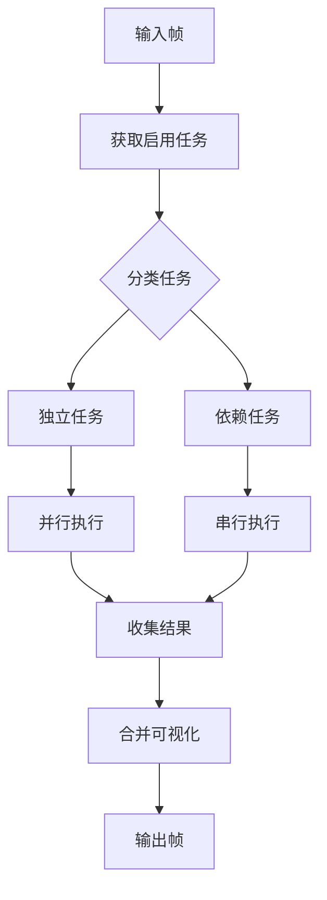

# AI 推理系统重构总结

## 重构内容

本次重构将原有的硬编码推理逻辑改造为可扩展的任务注册架构，支持多种AI模型的并行和串行执行。

## 主要改进

### 1. **架构设计**

#### 原有架构问题:
- 推理逻辑硬编码在 `_inference_loop` 中
- 只支持 detection 和 motion 两个任务
- 难以添加新的检测任务
- 任务间依赖关系不清晰

#### 新架构优势:
```
InferenceTask (抽象基类)
    ├── DetectionTask (关键点检测)
    ├── MotionTask (动作分析)  
    └── 自定义任务...
        ↓
TaskRegistry (任务注册表)
    ├── 管理任务生命周期
    ├── 自动处理依赖关系
    └── 计算执行顺序
        ↓
InferenceManager (推理管理器)
    ├── 并行执行独立任务
    ├── 串行执行依赖任务
    └── 合并可视化结果
```

### 2. **核心组件**

#### InferenceTask (推理任务基类)
```python
class InferenceTask(ABC):
    @abstractmethod
    def infer(self, frame, context) -> InferenceResult:
        """执行推理"""
        pass
    
    @abstractmethod
    def visualize(self, frame, result) -> np.ndarray:
        """可视化结果"""
        pass
    
    def requires_context(self) -> List[str]:
        """声明依赖"""
        return []
```

**职责:**
- 定义统一的推理接口
- 封装推理逻辑和可视化逻辑
- 声明任务间依赖关系

#### TaskRegistry (任务注册表)
```python
class TaskRegistry:
    def register(self, task: InferenceTask)
    def unregister(self, task_name: str)
    def get_enabled_tasks(self) -> List[InferenceTask]
```

**职责:**
- 管理所有推理任务
- 维护任务执行顺序
- 支持动态注册/注销

#### InferenceManager (推理管理器)
新增方法:
- `register_task(task)`: 动态注册新任务
- `enable_task(name, enabled)`: 启用/禁用任务
- `_execute_inference_pipeline()`: 执行推理管道

### 3. **执行流程**



#### 阶段1: 并行执行独立任务
使用 `ThreadPoolExecutor` 并行执行无依赖任务:
- DetectionTask
- BubbleDetectionTask (示例)
- StainDetectionTask (示例)

#### 阶段2: 串行执行依赖任务
按依赖顺序执行有依赖的任务:
- MotionTask (依赖 DetectionTask)
- CleanlinessTask (依赖 Detection + Bubble)

#### 阶段3: 合并可视化
按注册顺序依次调用每个任务的 `visualize` 方法

### 4. **内置任务**

#### DetectionTask (关键点检测)
- **类型**: 独立任务
- **功能**: 检测内窥镜关键点
- **输出**: 处理后的帧 + 关键点坐标
- **可视化**: 在帧上绘制检测框

#### MotionTask (动作分析)
- **类型**: 依赖任务 (依赖 DetectionTask)
- **功能**: 分析弯曲、浸泡等动作
- **输出**: 动作分析结果
- **可视化**: 显示动作状态文本

### 5. **扩展性**

#### 添加新任务只需3步:

**步骤1**: 创建任务类
```python
class MyTask(InferenceTask):
    def __init__(self):
        super().__init__(name="my_task")
    
    def infer(self, frame, context):
        # 你的推理逻辑
        return {"success": True, "data": "..."}
    
    def visualize(self, frame, result):
        # 你的可视化逻辑
        return frame
```

**步骤2**: 注册任务
```python
def _register_default_tasks(self):
    self._task_registry.register(DetectionTask())
    self._task_registry.register(MotionTask())
    self._task_registry.register(MyTask())  # 新增
```

**步骤3**: 启动服务
```python
from app.services import ai
ai.start()
```

### 6. **示例任务**

已提供两个完整示例 (`example_custom_task.py`):

#### BubbleDetectionTask (气泡检测)
- 使用 HoughCircles 检测圆形气泡
- 显示气泡数量和位置
- 独立任务，可并行执行

#### CleanlinessTask (清洁度评估)
- 依赖 detection 和 bubble_detection
- 综合评分和分级
- 可视化评分进度条

## 文件结构

```
app/services/
├── ai.py                          # 核心推理管理器 (已重构)
│   ├── InferenceTask              # 任务基类
│   ├── DetectionTask              # 检测任务
│   ├── MotionTask                 # 动作分析任务
│   ├── TaskRegistry               # 任务注册表
│   └── InferenceManager           # 推理管理器
│
├── example_custom_task.py         # 自定义任务示例 (新增)
│   ├── BubbleDetectionTask        # 气泡检测示例
│   └── CleanlinessTask            # 清洁度评估示例
│
└── ai_models/
    ├── detection.py               # 检测模型实现
    └── motion.py                  # 动作分析模型实现

docs/
├── AI_INFERENCE_ARCHITECTURE.md   # 架构文档 (新增)
├── QUICK_START_CUSTOM_TASK.md     # 快速开始指南 (新增)
└── REFACTORING_SUMMARY.md         # 本文档 (新增)
```

## 性能优化

### 1. 并行执行
- 独立任务使用线程池并行执行
- 减少总体推理时间

### 2. 任务隔离
- 每个任务独立运行
- 异常不会影响其他任务

### 3. 灵活控制
- 可动态启用/禁用任务
- 支持任务级别的超时控制

## 使用示例

### 基本使用
```python
from app.services import ai

# 启动推理服务
ai.start()

# 提交帧
ai.submit_frame("client_1", frame)

# 获取结果
result = ai.get_result("client_1")
```

### 注册自定义任务
```python
from app.services.ai import manager
from my_module import MyCustomTask

# 动态注册
manager.register_task(MyCustomTask())

# 启用/禁用
manager.enable_task("my_custom_task", enabled=True)
```

### 查看任务状态
```python
# 获取所有启用的任务
tasks = manager._task_registry.get_enabled_tasks()
for task in tasks:
    print(f"{task.name}: enabled={task.enabled}")
```

## 向后兼容

### API 保持不变
所有现有 API 保持不变:
- `start()`, `stop()`
- `submit_frame()`, `submit_base64()`
- `get_result()`, `remove_client()`
- `status()`

### 行为保持一致
- Detection 和 Motion 任务的行为与之前完全相同
- 输出格式保持一致

## 测试建议

### 1. 单元测试任务
```python
def test_detection_task():
    task = DetectionTask()
    frame = cv2.imread("test.jpg")
    context = {"results": {}, "task": None}
    
    result = task.infer(frame, context)
    assert result["success"] == True
    assert "keypoints" in result
```

### 2. 集成测试管道
```python
def test_inference_pipeline():
    manager = InferenceManager()
    manager.start()
    
    # 提交测试帧
    manager.submit_frame("test_client", test_frame)
    time.sleep(0.1)
    
    # 获取结果
    result = manager.get_result("test_client")
    assert result is not None
    
    manager.stop()
```

### 3. 性能测试
```python
def test_parallel_execution():
    # 测试多个独立任务是否并行执行
    start = time.time()
    # ... 执行推理
    duration = time.time() - start
    
    # 并行执行应该比串行快
    assert duration < sequential_duration / 2
```

## 未来改进方向

### 短期 (1-2 周)
- [ ] 添加更多示例任务 (污渍检测、清洁度评估等)
- [ ] 实现完整的拓扑排序支持复杂依赖
- [ ] 添加任务级别的性能监控

### 中期 (1-2 月)
- [ ] 支持任务优先级配置
- [ ] 添加结果缓存机制
- [ ] 支持条件执行 (根据结果决定后续任务)
- [ ] 添加任务配置文件 (YAML/JSON)

### 长期 (3-6 月)
- [ ] 支持分布式推理 (跨机器)
- [ ] 添加模型版本管理
- [ ] 实现 A/B 测试框架
- [ ] 支持在线模型更新

## 迁移指南

### 如果你有自定义的推理逻辑

#### 之前的做法:
```python
# 直接修改 _inference_loop 方法
def _inference_loop(self):
    # ... 硬编码你的逻辑
    processed = detection.detect_keypoints(frame)
    motion.analyze_motion(keypoints, task)
    my_custom_logic(frame)  # 你的代码
```

#### 现在的做法:
```python
# 创建独立的任务类
class MyCustomTask(InferenceTask):
    def infer(self, frame, context):
        return my_custom_logic(frame)
    
    def visualize(self, frame, result):
        return draw_my_results(frame, result)

# 注册任务
manager.register_task(MyCustomTask())
```

## 常见问题

### Q: 性能会受影响吗?
A: 不会。独立任务并行执行，总体性能应该更好。

### Q: 如何调试某个特定任务?
A: 禁用其他任务，只启用你要调试的任务。

### Q: 任务执行顺序如何控制?
A: 通过 `requires_context()` 声明依赖，系统自动计算顺序。

### Q: 可以在运行时添加任务吗?
A: 可以，使用 `manager.register_task()` 动态注册。

### Q: 如何传递大数据?
A: 通过 context 的 results 字段传递任务间的数据。

## 总结

本次重构实现了:
✅ 模块化的任务架构  
✅ 自动依赖管理  
✅ 并行执行优化  
✅ 易于扩展的接口  
✅ 完整的示例和文档  

开发者现在可以:
- 快速添加新的检测任务 (3 步完成)
- 灵活组合多个任务
- 动态启用/禁用任务
- 方便地测试和调试

## 相关文档

- [架构详细说明](./AI_INFERENCE_ARCHITECTURE.md)
- [快速开始指南](./QUICK_START_CUSTOM_TASK.md)
- [示例代码](../app/services/example_custom_task.py)

---

**重构日期**: 2025-11-23  
**版本**: v2.0.0  
**作者**: GitHub Copilot
