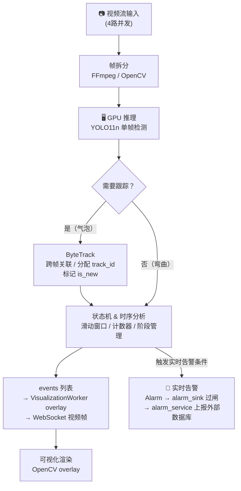
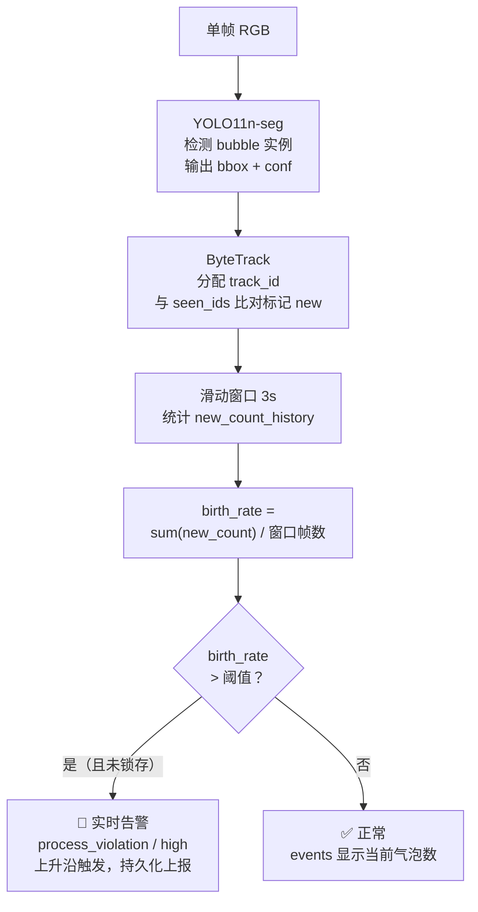
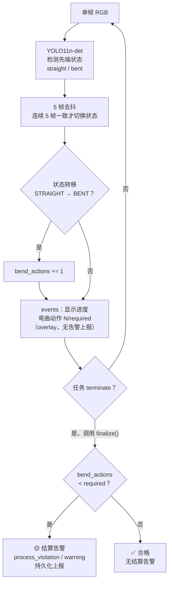

> 更新时间：2026-09-30
> 依据来源：代码分析
> 可信级别：以当前仓库代码、配置、测试为准；旧 docs 仅作待核验参考

# 检测 Workflow

> 本文是检测链路的**架构总览图**（流程与角色分工）。落点/接口细节以 [SERVICE_INFERENCE.md](SERVICE_INFERENCE.md)、扩展步骤以 [DESIGN_EXTENDING_DETECTION.md](DESIGN_EXTENDING_DETECTION.md) 为准。

## 整体流程

> **CPU / GPU 分工**：GPU 推理只做无状态单帧处理；ByteTrack、状态机、告警全在 CPU 上完成。

---

## 流处理框架（流源 Detector / 流算子 Operator）

每个 stage 拆 `detectors[]`（流源，分组粒度）+ `rules[]`（流算子，规则粒度）：

| 角色 | 基类 | 职责 | 状态机 |
| -- | ---- | ---- | ------ |
| 流源 | `Detector` / `YOLODetector` | 单帧检测，bbox=特征。无状态，多 Client 共享；`name` = 该 detector 产出的流名（= `FrameDetection.by_source` 的 key） | 无 |
| 流算子 | `Operator` | 合并 analyze+judge，单 `_sm`：`analyze(windows: List[FrameDetection])` `_clip` 到 `window_seconds` 感受野、按 `subscribes` 从 `by_source` 取订阅流、推进 `_sm`；`judge()` 读 `_sm` 出 (overlay 文案, 告警)；`finalize()` 结算。一个 Operator = 一条规则，每 Client 独立 | 共享状态机 `self._sm`（测量 + 决策同一份） |

> `name`（算子自身/输出身份）与 `subscribes`（输入流清单，显式必填）正交：算子名 ≠ 流名。
> 多流对齐在推理回收时一次完成：collector 按 req_id 把同帧各流装进一个 `FrameDetection`（`ts + {流名: DetectorOutput}`），
> 写回口原样分发，算子直接读 `by_source`，无需 zip（单订阅用基类 `primary_window` 投影自身流）。
> 阈值/required 归算子自身字段；`Alarm.metric` 由算子显式填，不依赖 name。

检测结果由写回口放进 cq 落盘缓冲，recording 拉走追加进该 run 目录的 `inference/detections.jsonl`（按帧 `ts` 对齐，推理失败的降级帧不落）。实时链路**不落事实**（状态共享于 `_sm`，无 `TemporalEvent` 对象间传输）；`inference/temporal.jsonl` 目前唯一写者是离线 Runner（写 `TemporalSegment`），另有可视化旁路 `label_probs.npz`。

## 两种告警模式

| 模式 | 触发时机 | 来源方法 | 去向 |
| ------ | --------- | --------- | ------ |
| 实时告警 | TemporalActor 2Hz 轮询，`operator.analyze()` 推进状态 → `operator.judge()` 上升沿触发 | `Operator.judge()` | `alarm_sink.persist_alarms` 过 5s 冷却闸 → `alarm_service` 队列 → HTTP 上报外部数据库 |
| 结算告警 | 任务 terminate 时调用一次 | `Operator.finalize()` | 同上，由 `ClientTemporalActor.finalize_and_stop()` 收集；`RunControlService.stop_run` 拿 `inference_service.stop_workflow(cq)` 的返回值调 `alarm_sink.persist_alarms(mode=SETTLEMENT)`，进程停机路径由 `InferenceService.stop()` 兜 |

> **UI 通知**：`events`（字符串列表）经 VisualizationWorker 渲染为视频帧 overlay，通过 WebSocket 实时推送给前端。`Alarm` 只走上报，不直接推给前端。

---

## 各检测点详细流程

### 1.1 漏气检测

> 无结算告警，漏气是实时检测，任务结束时 `finalize()` 返回空列表。

---

### 1.2 弯曲动作检测

> 实时阶段只产出 `events`（进度 overlay），**不上报告警**。  
> 合格（`bend_actions >= required`）无告警；不合格才在 terminate 时上报 warning。
